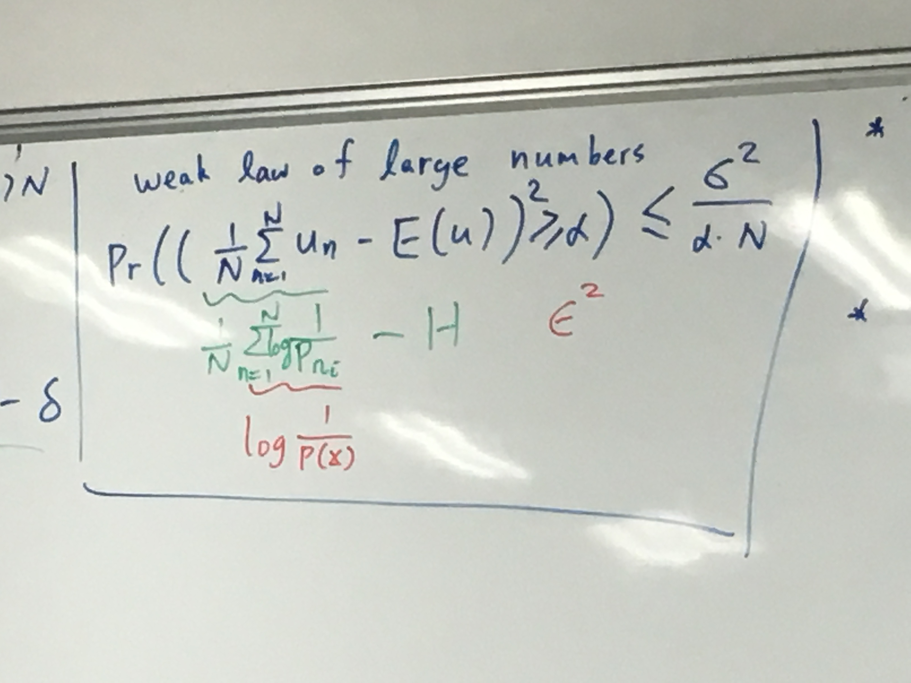
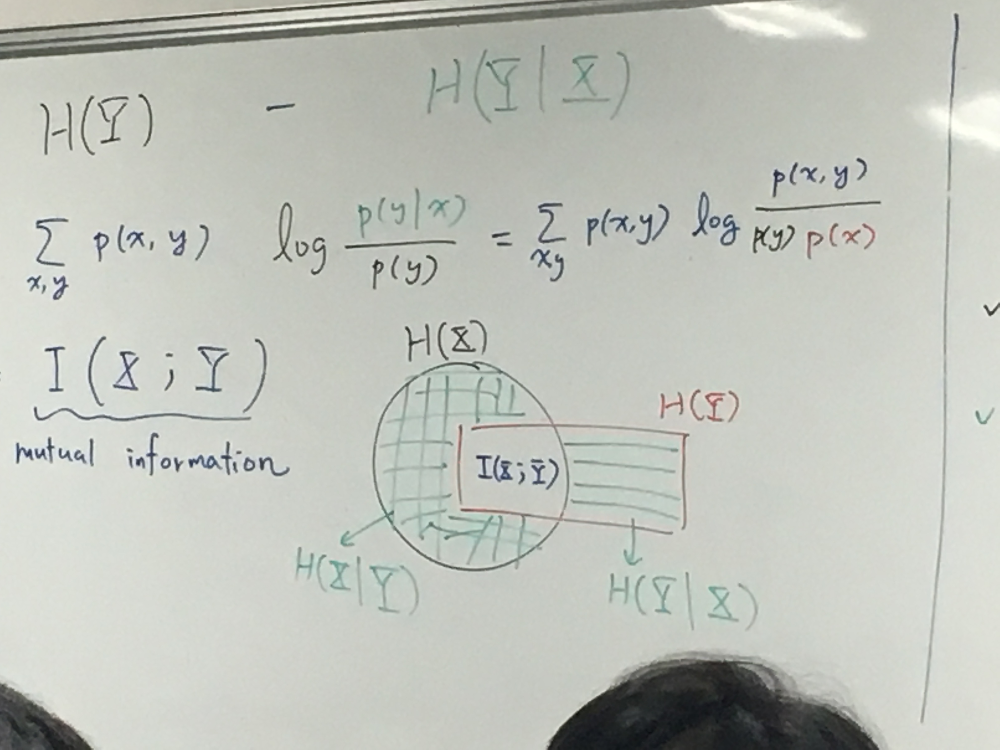
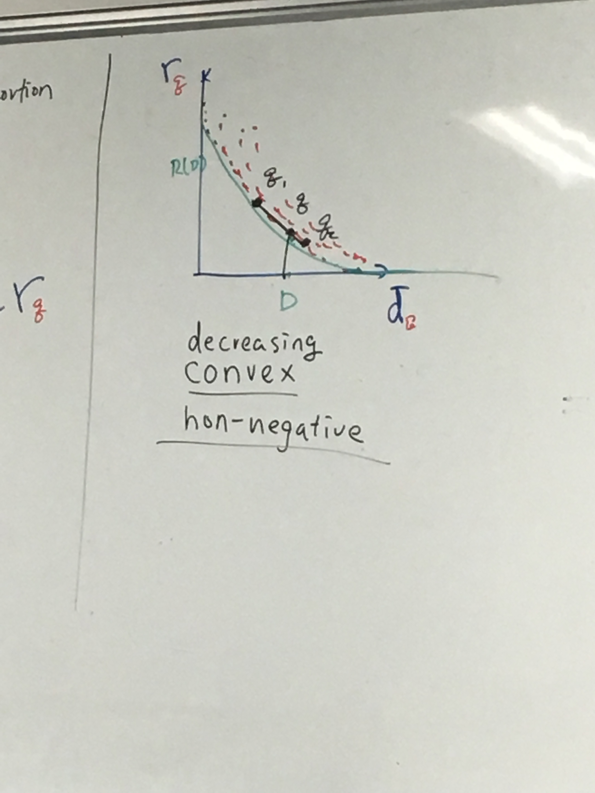
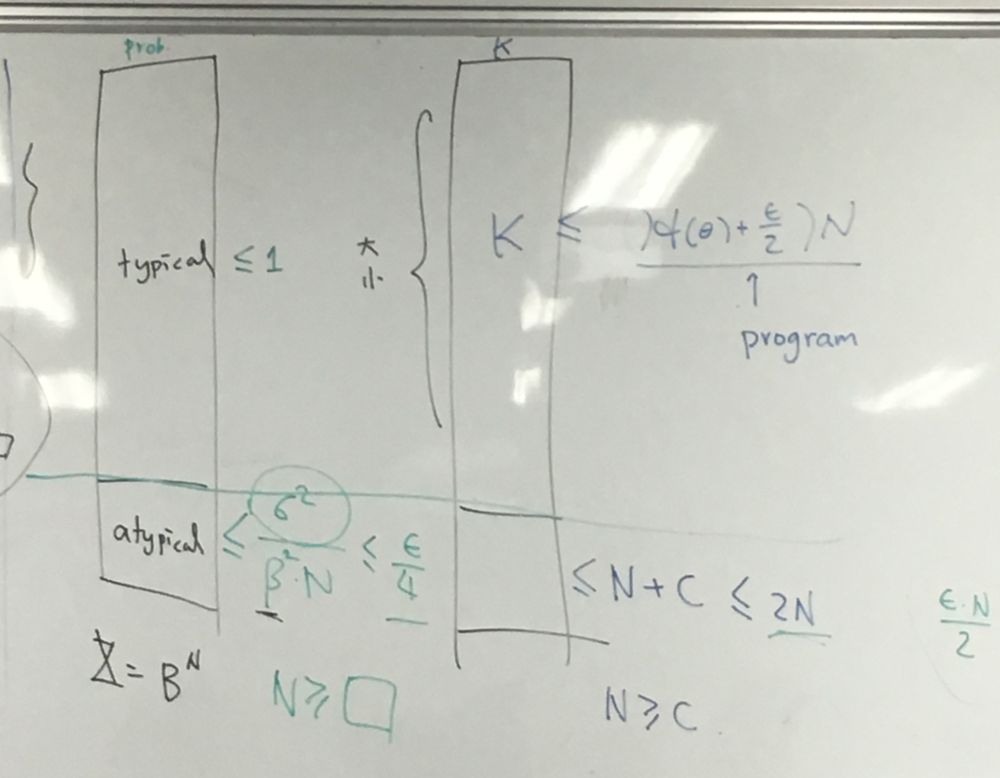
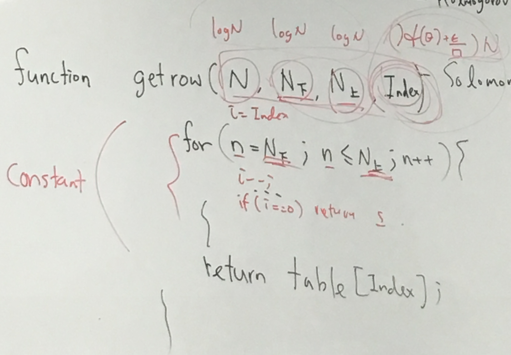

[TOC]
# I.T.T

## 1.Define Info.

Here is a table:

| B    | P    | M    |
| ---- | ---- | ---- |
| 0    | 0    | 1    |
| 0    | 2    | 0    |
| 0    | 3    | 3    |

If there’s a unknown answer which might be 0,1, 2 or 3, by known which column contains it , we can get to know what it exactly is.

e.g. it in **M**： Answer is 1.

e.g. it in **P** and **M** : Answer is 3.

Now we can call the bold **Alternatives** as “Information”, for it lead us from uncertainty to certainty **Outcome**

## 2.Deterministic Info.

There’s a finite set of such alternatives :
$$
\mathbb{Z}={\{a_1,a_2,\cdots,a_n\}}
$$
each alternatives has these attribution:

- Alternative: Uncertain possibilities
- Abstract: Not physical but universal
- Bidirectional: Currently the info. do not change from sender to receiver ( Dr. Lin also do not know why this attribution is necessary here, it has connection with further course. There still some argument why the Answer is 1 then we can know the pre-info. is **M**)
- Additive: Given info. A, and info. B equals given info.(A+B)

Now, define K:
$$
H_0({\{a_1,a_2,\cdots\}})=log_2K=log(\mathbb{Z})
$$

$H_0$ means 0-error , $\mathbb{Z}$ means 0-zero all necessary info set (Deterministic info.)

### Pigeon hole principle **(explain why we are still uncertain with certain information)

if $\mathbb{X}鴿子$>$\mathbb{Y}籠子$ , there’s no one-t-one mapping from $\mathbb{X} $ to $\mathbb{Y}$

X: Alternatives

Y: Names

One-to-one: $encoder: v(x)->\forall a_1 != a_2 , v(a_1)!=v(a_2)$   $ \exists decoder:\mu(x)  -> \mu(v(a))=a$

**證明題：**

**由於鴿籠理論 Hdelta（X） > H0（Y）**

**那麽沒有v和u（deterministic） 使得：**

**在$H_\delta$ 下，P（u(v(x))=x)>=1-$\delta$** 

****

證明 ：

如果存在v和u 使得等式成立

所有正確的符合等式的x是Hdelta裏面的大集合X ,X的剩下部分在decode和encode后會壞掉，小於等於delta的部分

由於鴿籠pri，鴿子一定要比籠子少->因爲正確集合的性質是在enc和dec全對，那由於鴿籠，它的量（x的正確集合，也就是下圖的綠框）肯定比Y籠子的量小。

。則H0(Y)>=log（x的正確集合的數量）>=Hdelta（X），就可以證明 H0（Y)>=Hdelta(X),則原條件有問題，反證法得證。

log（x的正確集合的數量）=H0（x的正確集合的數量)

//// 因爲正確集合的性質是在enc和dec全對，那由於鴿籠，它的量肯定比Y籠子的量小。

###  Sort size-n array of distinct elements

n! Alternatives needs T(log(n!)) to create each Names .

### *Can we do better than $H_0$?

NO. one-to-one can not be built, we can’t hold 0-error.(Pigeon hole principle)

YES, if some error?

e.g.  Here are 10 balls , 1 of them is heavier. If we use a balance to measure , can we measure 2 times to get 0-error outcome? No

However, if we just throw the first ball, we can archive that. and we have 1/10 possibility to fail. 

Now clear **P**:

$$
U\subseteq \mathbb{X},P_r(U)=\sum_{a_k\in U}P(a_k)
$$
U: event

as for $H_\sigma(\mathbb{X}=log|U|: U\subseteq\mathbb{X},P_r(U)>=1-\sigma$ (think about throwing not one balls but more(creating more U))

so:
$$
H_\delta(\mathbb{X})=log(min(|U|:U\subseteq\mathbb{X},P_r(U)>=1-\delta))
$$
We call it as **Probabilistic info.**

back to e.g. : $H_{1/10}<=log9$  :We can use a few Names to get Outcome we want.

$\mathbb{X}$: ensemble $P(a_k)>0$ for all $a_k$

*When we throw everything , we get $H_1$ = meaningless

Thus , define $\delta<1$ , $0<=H_\delta<=H_0, |U|>=1$

## 3.Entropy

從上面的我們知道Hdelta是一個函數，Shannon Entropy就是Hdelta的summa number，它來總結整個函數的情況。

Hdelta函數 在delta=0的時候等於H0，在delta無限大的時候Hdelta=0。 定義域0，無限大。 對應域（0，H0），**而且一定單調**

entropy評價對某個Hdelta，代表的case下信息分散的程度。

假設現在大X集合是 a1,a2,a3。設它們對應的概率是p1,p2,p3..(比方説你在case：a1，的單選題中有p1的概率答對，也就是説你有1/p1個選擇。),a1,a2,a3..是你選對的那道題。要做對a1，需要log(1/p1)個bit。

對於這個大X集合的summary number，每個需要的bit量的加權平均值就是Entropy。

Entropy可以表現你這整套試卷($\mathbb{X}$) 的平均需要的信息量：
$$
Shannon Entropy:H(\mathbb{X})=\sum P_i *log_2{(1/p_i)}
$$
H函數輸入集合大X，返回它的entropy。

注意：lim(x->)log（1/x）->0

對於絕對，p=1，H0=0(要知道一定發生的事情需要的信息量是0bit)

證明 H<=H0

->  
$$
\sum P_i Log(1/p_i) -\sum P_ilogK<=0
$$

->
$$
\sum P_i (ln(1/p_i*K)/ln2)
$$
for ln$\theta$ <= $\theta$-1
$$
\sum P_i (ln(1/p_i*K)/ln2) <= (1/ln2)\sum P_i((1/P_i*K)-1)=0
$$
當Pi=1/k 的時候等式成立（全部ai的幾率相等)

如果一個系列的ai，它的p是兩個步驟來決定的，有p的概率做第一步的選擇，q概率做第二個。我們把上面的pi換成$p_i*q_{ij}$就可以。

->
$$
H(\mathbb{X})=\sum_{合法ij}（p_iq_{ij}log(1/p_iq_{ij})
$$
->
$$
=\sum_ip_i\sum q_{ij}log(1/q_{ij})+\sum(p_iq_{ij})log(1/p_i) (最後的q_{ij}是1，去掉后就只有p_i)
$$
**上式説明了entropy的可加性。**
$$
=\sum_i P_i* H(\mathbb{X}_i)+H(\mathbb{X}_{top})
$$

推廣：

H(X*X)=2H(X)

### Talking $H_\sigma \approx H$(Sample Mean and Expectation)

Imagine $H_\sigma(\mathbb{X}^n)$ and $H(\mathbb{X}^n)$, if n is big enough,  then whether  $H_\sigma \approx H$ ?

-> $(1/N) H_\sigma(\mathbb{X}^n) \approx H(\mathbb{X})$

s.t :  TO PROVE : $1/N*\sum_{i=1}^Nlog(1/P_{ki})\approx H(X)$:expectation of $log(1/p_k)$

左側相當於是一套選擇題有N道題，做出其中一套答案的幾率為P，左側相當於1/N* log(1/P).

For example: 每道題有三個選項，A,B,C。隨機猜A的概率30%，B是30%，C是40%。

根據統計學知識，答案中A的個數會收束在0.3N上，B,C同理。假設約等成立,則產生其中一個答案的概率P約等於$2^{-NH}$

這裏大P，記作$P=P(Q_1Q_2Q_3...Q_n)$ Q是每道題答案
$$
(many)P\approx2^{-NH}  (該式簡潔地揭露了P和H的聯係,N是測試的次數（也就是選擇題的個數）)
$$
->
$$
\{2^{NH}P\}\approx1  (H是H(\mathbb{X}))
$$
->
$$
NH\approx H_\delta
$$
**證明：**要證明約等，則要知道：
$$
Pr((1/N\sum^N_{n=1}u_n-E(u)^2)>=\alpha)<=\sigma_u^2/\alpha N
$$
也就是説左邊的平均概率和我們的Expectation：E的差大於alpha的概率（不等於），是小於平均方差

對於random variable：r 和它的 expectation：E（r)
$$
Pr((r-E(r))^2>=\alpha)<=\sigma_r^2/\alpha
$$
相當於在求對一個random variable: t :（t>=0)
$$
Pr(t>=\alpha)<=E(t)/\alpha
$$
E(t)就相當於r的標準差$\sigma$.  所以證明上式正確，原式就正確。

而標準差$\sigma=\sum P(t)/\alpha$

左邊則等於$\sum P(t)[t>=\alpha]$

->
$$
\sum P(t)[t>=\alpha] <= \sum P(t)t/\alpha (chebyshev's Inequality)
$$
現在討論約等號：

考慮實驗次數。

Given E>0 . 

there exits N0 s.t.

N>=N0  ->  $|1/N H_\delta(\mathbb{X}^n)-H(\mathbb{X})|<E$

->
$$
(1/N)H_\delta(X^n)<H(X)-E
$$
我們現在記U是X的一個子集，U是一個大概率集

有
$$
(1/N)H_\sigma(X^n)<=(1/N)log|U|<H(X)+E
$$
U:{Z：p(z)>$2^{-(H+E)N}$}

log|U|<(H+E)N

在U中，typically 一般出現的情況是T，

以上的推論是想找出，通過覆蓋最常出現的選擇題回答的序列，來找到最少的bit讓我們可以得出OUTCOME

*Shannon’s first theorem: 揭露了概率和熵的關係:

give 0<e ,o<$\delta$

there exists no such that :
$$
N>=N_0 -> H-e<(1/N)H_\delta(\mathbb{X}^N)<H+e  (1式)
$$
做了N次實驗的典型結果T：

其P（T）>1-$\sigma^2/e^2N<\delta$ ,説明了（1式的上界）

（證明最上面的不等式，右半邊是用一個T，T的大小是在典型情況浮動， T既然是U的子集合自然要小於U。T是典型集

左邊是假設有個V，V很小。V有何T重合的部分，也有不屬於T的部分，那他們小於T對X的補集再加上V定義的數量（$2^{(H-e)N}$，再乘上V的最大概率=1，那顯然V的最大概率不能那麽大，他一定要足夠小，再還要滿足他有U的部分，則U有一個下限的。

整個不等式（1式） 描述了N次實驗下$H_\delta$和H的關係（前者落在後者+-e的區間）

## 4.Physical Coding（block Coding)

現在我們知道
$$
N>=N_0 -> H-e<(1/N)H_\delta(\mathbb{X}^N)<H+e  
$$
那對於典型集：
$$
log|2^{H_\delta}+1|\approx H_\delta\approx NH
$$
説明N次實驗需要NH來存，則每一次的典型情況都需要H個bits來記錄。我們就可以知道Bit rate差不多是H。這叫block coding：一次decode N次實驗的情況。Block的長度就是H。也就是$H_\delta/N$

Block coding 核心：(化成等长的块)
$$
H_\delta(X^n)\approx_{block} NH(X)
$$
Symbol Coding 核心: 按照概率化成不等长的块（比如haffman）
$$
H(X)
$$

## 5.Source Coding(Symbol Coding)

*realistic coding to archive H

symbol coding :  x->v(x)

對於一系列a1...ak編碼成v(a1)...v(ak),出現概率是p1..pk，編碼長度是n1...nk。

編碼后平均長度是
$$
n_{average}=\sum p_kn_k
$$
## 6.UD Code (uniquely decodable)

現在證明某些情況下它約等於block code length $\approx$ H

-X

要做到errorfree編碼：UD （可解码编码）

就是要做到有
$$
UD:  \sum_{k=1}^{k}2^{-n_k}<=1 (Kraff's)
$$
↑也就是從a1到ak,每個的長度要滿足上式。

->
$$
UD for N=1 : \sum_{i=1}^上|\{k:n_k=i\}|*2^{-i}<=上
$$

$$
UD for N=2 : \sum_{i=1}^{2上}|\{k:n_k+n_e=i\}|*2^{-i}<=2上
$$

## 

## 7.Symbol Coding

上面證明了平均最短碼率是 Entropy. 

現在考慮
$$
H(\mathbb{X})-n_{ave}=\sum p_k log(1/p_k)-\sum p_k n_k
$$
->(因爲$n_k是log2^{n_k}$)
$$
=\sum p_k (ln/ln2)(2^{-n_k}/p_k)<=\sum p_k(2^{-n_k}/p_k-1)  (因爲x-1>=lnx)
$$
->因爲$\sum p_k=1$ (另外假設UD真的存在，sum的結果小於等於1)
$$
=(1/ln2)(-1+\sum 2^{-n_k})<=0
$$
結論：
$$
H(\mathbb{X})<=n_{ave}
$$
等號發生的條件：
$$
1. (1/p_k)*2^{-n_k}=1 也就是n_k=log(1/p_k)
$$
另外UD成立：
$$
2.\sum 2^{-n_k}=1
$$
結果：對於一個編碼要是能做到碼率逼近H，那： 小的$p_k$相當於大的$n_k$ (從信息論角度證明了haffman編碼的結果之必然性)

經過以上結論，就可以通過p或者n來構建haffman編碼所需的 Binary Tree.

構建過程略；

在一個$2^n$的完全數裏安放a1,a2...an。

每一次將消耗$2^{n_{max}-n_k}$個node. 而且有：
$$
\sum _k 2^{n_{max}-n_k} <= 2^{n_{max}}
$$
haffman編碼是uniquely decodable . 這樣的很明顯的coding稱爲 instaneous (can immediate decode)：每個$a_n$可以直接部署在tree裏。 數學上叫prefix-free. instaneous code 是UD的一個子集。

以下再示範二者區別: 兩種編碼都是UD: $\sum 2^{-n_k}<=1$

| source | instaneous | non-instaneous |
| ------ | ---------- | -------------- |
| a1     | 1          | 0              |
| a2     | 01         | 01             |
| a3     | 001        | 011            |
| a4     | 0001       | 0111           |

很明顯 instaneous的性質是順序讀取時可以立馬decode。decoded code可以連續存在互不干擾。

綜上，ID是UD的special case.通過$\sum 2^{-n_k}<=1$可以construct 一個ID。

### * if $log(1/p_k)$  not integers：

naive idea: use $n_k = [log(1/p_N)]取上整數$ 。則：
$$
n_{ave}=\sum p_kn_K<\sum p_k(log(1/p_k)+1)=H(\mathbb{X})+1
$$
用block coding思路: 對於$\mathbb{X^n}$: avg. length per symbol 要花費 $H(\mathbb{X})+1/n$ 

### Haffman Coding

一個性質： $n_{ave}$

claim: p1>=p2>=p3...>=pn

​          n1<=n2<=...<=nk

claim: $n_{k-1}=n_k$ ->要盡量把每個decode在binary tree上往上移，減少n

因此誕生算法:嘗試將最長的兩個長度相等的source code移動到相等level。可以首先給他們一個common prefix,然後用1和0分開。再merging。這個算法縮寫叫HC： haffman coding.

haffman的思路即從最小p的a出發，由下往上構建Binary tree.

haffman所做的：

1. 找兩個最小p的a。

2. 通過$HC(p_1,p_2...p_{k-2}，p_{k-1}+p_k)$

   變成$v(b1),v(b2),....v(b_{k-1})$

3. v(ai)=v(bi)

   v(ak-1)=v(bk-1) combine “0”

   v(ak)=v(bk-1) combine “1”

   

## 8.‘Quantization’ Coding

*What if “many” of all are slightly wrongly coded?

for an example of X={1,2,3,...,100} (which needs log100), and we encode(概算) it into Y={5,10,15,...,95} -> H0=log19

that $Y\sube X$， how to measure the **distortion**: d(x,y) between X and Y ?

We set this measuring procedure as **quantization**.(reminds of JPEG??)

There’s two attribute of quantization , rate: |Y| and distortion :**d(x,y)=（x-y)^2**

e.g.  X={1,2,3,4,5,6} , Y={1,3,5} 

其中一種可能編碼，這種編碼抛棄2，3，6.如果X中出現2,3,6則會在編碼中損失。
$$
\begin{array}{lc}
\mbox{}&
\begin{array}{cc}1& 3 &5\end{array}\\
\begin{array}{c}1\\2\\3\\4\\5\\6\end{array}&
\left[\begin{array}{cc}
1&\\
&1\\
&1\\
&&1\\
&&1\\
&&1\\
\end{array}\right]
\end{array}
~~deterministic ~~~quantization
$$
在Y中： 1出現概率p1，3出現p2+p3，5出現p4+p5+p6,pi是X中的各個概率
$$
\hat d=p_2+p_3+p_6
$$
另一種從X到Y的編碼，這次是概率隨機分配。(這種叫**scalar quantization**)

$$
\begin{array}{lc}
\mbox{}&
\begin{array}{cc}1&2& 3&4 &5&6\end{array}\\
\begin{array}{c}1\\3\\5\end{array}&
\left[\begin{array}{cc}
1&1/2&&&&&\\
&1/2&1/2\\
&&&1/2&1/2&1/2

\end{array}\right]

\end{array}
randomized-quantization
這圖需要修復
$$
這裏1出現概率p1+1/2p2,3出現1/2p2+p3+1/2p4 , 5出現1/2p4+p5+p6

$$
\hat d=\sum p(x)p(y|x) d(x,y)
$$
目標就是找到一個$Y_q$：
$$
rate:min ->r_q=H(Y_q)
$$
有：
$$
\hat d_q=\sum _{x,y}p(x)q(y|x)d(x,y)\le instance
$$
e.g.2

如果X={0,1}=Y

其中編碼時候1有$\delta$ 概率變成0，那
$$
r_\delta=H((1+\delta)/2)
$$

$$
\hat d_\delta =1/2*\delta
$$

説明 randomized quantization 裏 $\hat d$ 和rate 正相關。當\delta =0.88的時候, hat d=1/2\delta=0.44. r=1/3

在考慮1有$\delta_1$概率變成0，那麽
$$
\hat d=1/2(\delta+\delta_1)
$$

$$
r=H((1+\delta-\delta_1)/2)
$$

利用**block（vector）quantization**可以在差不多的rate下面得到低的distortion：

X^3 ->{000,111}

可以讓$x\in X^3$,1多的=111，0多的=000，會得到更好distortion。這裏avg rate=1/3, avg distortion =6/8/3=1/4

***vector distortion** 
$$
d(\underline x,\underline y)=1/N\sum_{n=1}^N d(x_n,y_n),x,y\in X^N
$$

**那麽透過vector distortion能做到多好？**

對於一個X={0,1},Px={1,0},編碼到Y，0有1/2概率編碼成1，1/2變成0，而1不出現。那：

typical y $\in Y^n$ , 是half 0, half 1， 而typical x是all 0 

這樣以來 對於給定的x ，其transition uncertainty：
$$
\sum_x q(y|x)log(1/p(y|x)):transition Unvertainty
$$
下面定義Conditional entropy:
$$
\sum_xp(x)\sum_x q(y|x)log(1/p(y|x))=H(\mathbb{Y|\mathbb{X}})(conditinal Entropy)
$$
真正的uncertainty 是 H(Y)-H(Y|X).

另外知道 joint ensemble entropy：
$$
H(X,Y)=\sum_{x,y}p(x,y)log(1/p(x,y))
$$
->
$$
H(X)=\sum_x\sum_yp(x,y)log(1/p(x))
$$

$$
H(Y)=\sum_x\sum_yp(x,y)log(1/p(y))
$$

$$
H(Y|X)=\sum_{x,y}p(x,y)log(1/p(y|x))
$$

->
$$
=\sum_{x,y}p(x,y)log(p(y)/p(x,y))=H(X,Y)-H(Y)
$$
相似地：
$$
H(Y|X)=H(X,Y)-H(X)
$$
hint: H(Y|X)=H(Y) given X.

現在再考慮H(Y)-H(Y|X）=
$$
\sum_{x,y}p(x,y)log(p(y|x)/p(y))=\sum p(x,y)log(p(x,y)/p(y)p(x))=I(X;Y)
$$
上式記作：  Mutual Information ,注意中間式子裏x，y的對稱性。

n.d.  如果x,y是獨立事件，p(x,y)=p(x)p(y),那麽log裏的東西是1，log1=0，I（X;Y)=0.即X,Y之間無mutual Info.

↑ The whole graph represents H(X,Y)

我們同樣也可以得出:
$$
0\le I(X,Y)=H(Y)-H(Y|X)\le H(Y)
$$
繼續看：
$$
\sum p(x,y)log(p(x,y)/p(y)p(x))=I(X;Y)
$$
上下翻轉log内容：
$$
-I\le1/ln^2\sum p(x,y)[p(x)p(y)/p(x,y)-1](不等式x\ge1-lnx)
$$
又
$$
\sum p(x,y)[p(x)p(y)/p(x,y)-1]=1-1=0
$$
->
$$
I(X;Y)\ge0
$$
*typical x in X^n : $p(x)\approx2^{-NH(X)}$

*typical y in Y^n : $p(y)\approx2^{-NH(Y)}$

->typical (x,y) in (X*Y)^n: $p(\underline x,\underline y)\approx 2^{-NH(X,Y)}$

如果上面三個條件都滿足，可以說是jointly typical (x,y) in X,Y.

->
$$
p(x)p(y)/p(\underline x,\underline y)=2^{-N(H(X)+H(Y)-H(X,Y))}=2^{-NI(X;Y)} (KindOfUncertaintyBetweenXandY)
$$
->
$$
\sum_ilog (p(x_i)p(y_i)/p(x_i,y_i))->I(X;Y)
$$
總結，對於從X到Y的encoding，考慮誕生的(x,y)，從數量來説(x,y)的縂概率要是$2^{N(H(X)+H(Y))}$，這相當於把typical x和typical y組合起來。

但是實際上Y的情況和X据有關連，一個typical x出現對一個特定y的出現有影響。因此typical （x,y)是$2^(NH(X,Y))$

請注意H(X)*H(Y)$\ge$H(X,Y),當X,Y獨立的時候等式成立。而它們的比，也就是X,Y的聯係度：
$$
2^{NH(X,Y)}/2^{N(H(X)+H(Y))}=1/2^{NI(X;Y)}
$$
所以説I表現了X,Y的一種相關程度，也就是我們能“掌握”X,Y相關度，也就是編碼時的certainty衡量所需要的信息量。

## 9. Rate-distortion tradeoff for Vector Quantization Scheme

*per symbol quantization scheme q(y|x):

for a distortion d(x,y):
$$
\hat d_q=\sum_xp(x)\sum_yq(y|x)d(x,y)
$$
the formula above defines average distortion of x->y

Now consider an ensemble X-q>Y, q(y)=$\sum_x q(y|x)p(x)$

也就是X，quantify到Y，其中的概率。根據之前的理論:
$$
I_g(X;Y)=\sum_x\sum_y q(y|x)log\frac{p(x)q(y|x)}{p(x)q(y)}
$$
其中一個結論是，當要做X->Y,如果用scale quantization, 根據最前面的理論要花費H（Y），但是現在可以從所有quantization裏找到一個，使得$I_q(X;Y)$是最小的，那麽就有$\hat d_q\le D$,就可以用$I_q$的bit來做，這裏就變成了vector quantization，這個時候$I_q$就變成了rate，記R(D).

這個小q是個scale quantization 

該圖叫 rate-distortion curve， 描述 VQ Scheme

上圖的紅綫表示各種q，綠色表示最小的q，形狀反映了d越大 rate越小，他們是此消彼長的。

Rate的完全定義是：
$$
R(D)=min_{VQ} \frac{logX}{N} :s.t. d_{VQ}\le D
$$
就是對於D， D是一個我們接受的可以will show的程度，能做到的最小rate。我們找到最小的$I$， 使得distortion都比D要小。

*rate-distortion theorem:

given $X,p,Y,d(x,y),D$:

if $R_I(D)=R$ (意思是這個R是在某個scale quantization下拿到的I產生的):
$$
R_I(D)=min_{q:\bar d_q\le D} I(X;Y)=R
$$
then exists VQ scheme with $M\le2^{(R+e)N}$ codewords, and $\hat d_{VQ}\le D+e$ (這裏e是爲了證明需要)(N足夠大)

**這個M就是對應的Codewords:|C|= $|\mu(X^n)|$ 的數量**

->
$$
R_{VQ}=\frac{(R+e)N}{N}
$$
(上面的VQ scheme 需要有on length-N vector for N large enough ,也就是把N的 向量x變成向量y，兩個向量分別屬於X,Y

這裏判定依然用$d(\mathbb{x},y)=\frac{1}{N}\sum_n d(x_n,y_n)$)

(在上面的d_VQ,就是我們證明中假定$\hat d_{VQ}=R_{(V)}$)

->

thus:

$R_{(V)}(D+e)\le R_{(I)}(D)+e$

接下來仔細研究vector quantization，即從x變成y的情況， 一般總有一個最佳匹配使我們有最棒的D-R曲綫。這個的策略會是“Min distance”,

那麽我們應該關注X中的x的typical的情況，我們知道它的概率是$2^{-2NH(X)}$

總結：

1. 選擇的映射應該有最小的distortion. $v(x)=min_{c_m} d(x,C_m)$
2. 對於編碼,要把typical的x做好only care about typical .

目標就是
$$
d(x,v(x)) (typical )\le D+\frac{1}{2}e (forEveryTypical (x)
$$
這裏的1/2改成任何小於1的分數都可以。

Lin的思路是抓typical 的x放給typical的y，typical的x有$2^{NH(X)}$個。

如果只抓typical，那麽最後會得到
$$
\hat d(typical x,typicaly)\le D+ke,0<k<1
$$

但是問題是，typical有2^{NH(X)}個，但是我們上面說了這個d下只能有M個codewords.

**方法一** ： Typical First

我們需要從X和Y共同的關係出發，定義T(x,y):
$$
T_{(x,y)}=\{(x,y):p(x,y)\approx2^{-NH(X,Y)}\}
$$
這裏Y是一個我們可以從中選出codewords的集合，x，y均是向量（因爲在討論VQ），并非Y就是編碼好的codewords assemble

把上面的式子變化一下，依然要求滿足$\bar d\le D+e$，我們要求（x,y):
$$
|\frac{1}{N}log\frac{1}{p(x,y)}-H(X,Y)|\le e
$$

$$
|\frac{1}{N}log\frac{1}{p(x)}-H(X)|\le e
$$

$$
|\frac{1}{N}log\frac{1}{p(y)}-H(Y)|\le e
$$

上式的形式都是*Sample‘s entropy -Exception<= e*:
$$
|\frac{1}{codelength} H(sample)-Entropy|=|CodeRate-Entropy|\le e
$$
以上的條件滿足的( x,y)（均為向量）就成爲了 **jointly typical** : 
$$
\frac{1}{N}log\frac{p(x,y)}{p(x)p(y)}-I(X;Y)\le 3e
$$
記：
$$
i(x,y)=\frac{1}{N}log\frac{p(x,y)}{p(x)p(y)}
$$
jointly typical 在數學上説明它和I(X;Y)不會差太大

(x,y)要成爲jointly typical,既要滿足x是typical，y是typical，還要滿足x，y這對組合的出現也是typical的。

它的關係度是低於等於I(X;Y)

如果(x,y)還能滿足：
$$
|\frac{1}{N}\sum d(x_n,y_n)-\bar d_q|\le e
$$
則它還是distortion typical

由此定義出T：
$$
T:\{(x,y)|i(x,y)-I(X;Y)\le e,d(x,y)-\bar d_q\le e\}
$$

**方法二** From Codebook

想找幾個在Y^n中的c，它們是distortion typical y. 它們滿足distortion typical. 上面已經說了這樣的c一共有M個

然後再從X^n中挑選x去匹配。

問題是如何找到這個$\mathbb{C}$,即codebook？  各個c應當盡可能分散，避免損失。

*a “randomized algorithm” for “constracting” $\mathbb{C}$

$\mathbb{C} ->（p(y)^M$ for one typical $x_1$:

**如果M次都沒有匹配到($pay>\bar d_q+e$)，這個概率是$(1-P_{T(x_1)}(y))^M,P_{T(x_1)}(y)=\sum_{y\in T(x_1)}p(y)$**

補充：這個意思是對於一組特定的codebook，讓x1找不到裏面有合適的c的概率。

要讓這個概率足夠小，1-XX的XX部分足夠大：

因爲：
$$
\frac{1}{N}log\frac{p(x,y)}{p(x)p(y)}-I(X;Y)\le e
$$

$$
\frac{p(x,y)}{p(x)}=p(y|x)
$$

所以:
$$
\sum_{y\in T(x_1)}p(y)\ge \sum_{y\in T(x_1)}p(y|x)\times 2^{-(I+e)N}
$$
這裏
$$
\sum_{y\in T(x_1)}p(y|x) \approx 1 ~~~（tricky)
$$
對於 $(1-P_{T(x_1)}(y))^M$
$$
=e^{Mln(1-P_{T(x_1)}(y))}\le e^{M(1-P_{T(x_1)}(y)-1)}=e^{-2^{(R+e)N}2^{P_{T(x_1)}(y)}}=e^{-2^{eN}}
$$
thus:
$$
(1-P_{T(x_1)}(y))^M+atypical \le d_大\le e
$$

## 10.Stage sumury

*How many bits to **represent** $\mathbb{X}$ error-free?  $H_o(X)$

[compression]*How many bits to **represent** X^n with error $\delta$ (fixed-length)? $NH(X)$

[compression]*How many bits to **represent** X with error $\delta$ (var-length)? $H(X) $ on avg.

[+quantization]*How many bits to **represen**t X^n with fixed-length codewords with $\le D$  distortion? $NR_I(D)=N\times min_qI(X_q;Y_q)$

## 11. From represent to transmit(Channel Coding)

*How many bits to transmit X^n with $\le \epsilon$ error (**Through “Known” noise p (y|x)**)?

> Shannon’s Second Theory

在這個問題，可以推測出結果的上限是一個 $<\approx N*C$ 的形式,$C=max_qI(X;Y)$

### *transmit model :  X->Y

X={1,2,3,...,K} , Y={1,2,3,...,J}（may be different symbol system)

對於noise(error) : p(y|x），很容易理解它形成一個probability transmit matrix,這裏記作 **Channel**

計算error的方法：  考慮$X-\nu>Y-\mu>\hat X$, error= $E_{p(y|x)}[[x\ne \mu(y)]]$

worst-case : error=$max_x E_{p(y|x)}[[x\ne\mu(y)]]$

説明x不能全部選來自X的，應該是 $\underline x\in codeblocks \subset \mathbb{X}^n$, thus:

“safe” transmission:

transmit only $\{x_1,x_2,...,x_M\}$  such that $P_E^{\underline x_m} \le \epsilon $ （使用channel的次數是M）

上面的意思是說，如果我們傳送all x in X, channel的使用率過大。 我們可以在error<e的情況下只傳送M個$\bar x$過去。（注意，我們送的是X^n的一部分，所以這裏是$\bar x$,也就是我們的codeword）

Q: What is maximum $\frac{log M}{N}$ ? （這裏分式相當於channel的使用率）

A: $\approx$ max. mutual information $I(\bar X_q;\bar Y_q)$= C

這個C就是一開始我們預測的C,  Channel Capacity.

> 傳送的X是n個unit， 取M個Codewords去transmit。C=$\frac{logM}{N}$ , $\mu$ 是deterministic。

Codewords肯定是會分散在X^n裏。

### final statement:

given 0<R<C and $\epsilon >0$

that exists a protocol  that archieves rate logM/N >= R

and error max_m $P_E^{\underline c_m} \le \epsilon $

 

### *Transmit Steps

1. assume q(x) that achieves $\C$, construct p(x,y)

2. construct $\C$ by sampling from $p(\bar x)$ for M times

3. $\mu(y)=\underline c$ iff $(\underline c, \underline y)$ singly jointly typical

   $\nu(\underline x)=\underline c$ iff  $d(\underline x,\underline c)$ smallest.

   

> underline x 和 x bar 疑似是一樣的

### Explanation  in General

我們在這一章做的是，對於一個沒有概率問題需要考慮的X^n,要通過channel來transmit成Y^n.

那麽三個步驟是：

1. 我們沒必要把每個element in X^n,都丟給channel。我們需要挑選一部分比較不容易出問題的element，也就是構建q(x)，這部分我們挑出來的就稱作codebook，他們構成一個建立在channel 上抽象的p(x,y)（這個實際上不存在）

2. 那麽緊接著1，這部分x要怎麽找出來呢？ 我們丟x進channel，然後看出來的哪些y再對應回來的x的情況，找到每個q(x)(q(x)的意思就是取一部分x in X)，找其中表現最好的，也就是再對應回來的x和原來的x的joint Information

3. 完成1和2后，我們就可以推導出我們要的encoder和decoder的性質，也就是我們找到的codewords和y是joint typical，而且我們的x和c的distortion是最小的。這樣就封閉了我們的理論。

4. 注意整個有M個元素的的Codebook，傳N長度的信息（channel使用了N次），碼率是$\frac{logM}{N}$ 

   在這個概念上注意最大的capacity是$C=maxI(X_q;Yq)$ .

最終，目標是對於直接傳輸的R，我們有： for any R<C,$C>rate\ge R$。 當M=1，相當於codebook裏只有一個選擇，那每次都只能傳它，rate相當於是0（無變化）.

在物理上，Codebooks做的事情是把比較容易受noise而混淆的info拉開成不易被noise干擾而混淆的C進行傳送，進而增大distortion.

5. 邊緣情況： 1. 不太typical：會存在有拿到的y無法decode。(如果M很大，這個可能性很小)

    	2. Typical ： M不是很大也OK

## 12. Info in “program”（Compression)

Back to last chapter. Let’s talk:

*How many bits to represent X={s1,s2,...sk} where $s_m\in \{0,1\} $ 

如果要存儲一個zip檔案：
$$
Symbol~table+Huffman~info+encoded~bits\approx NH(X)
$$

*compression of binary string losslessly:
$$
S->\nu(S)->\mu(v(S))=S
$$

$$
\in\{0,1\}(infinite)~~\in\{0,1\}(infinite)~~\in\{0,1\}
$$

目的是|v(s)|<|s|

但是概念上，|v(s)|<|S|這件事是不能做到。用我們一開始的知識，S的H0是N，v（s）的H0是log(2^n-1),所以不能完成一對一lossless，（鴿籠原理也可以説明這個）

但是有些“easy”情況： 比方説 S= 0000...0, or S=01010101....01.,這些相對完全random的”hard“情況，是有規律的，我們稱： **Programming easiness**

### *Kolmogorov(-Chatin)Complexity

> with respect to an universal computing model U

$$
K_u(S)=min\{|P|:U(P)=S\}
$$

注意:这里的K值（柯氏复杂度）是基于U的。所以记K_U， U不一样，K也不同。这里的P是program，可以是一些不同的Turing machine之类。

**An important feature of K-Complexity: Kolmogorov complexity is small relative to the string's size**

Explain:

S is a binary string $\in \{0,1\}$, let U run a function with input of P, and check if we can get such S as a output. Here, the symbol "=" , means halts and outputs.(S’s length is limited). And an extra **requirement** is we want the simplest program P.

*One of computing model is the **Turing machine**(Does not mean U can be M, but P can be M). Turing machine already defined "computable function”, which is a transition from INPUT to OUTPUT , with 3 possible procedure: Move forward, Move back, Write(in the time of tape) , which is a mechanical computing process that can **halt**.

Thus :  f is a computable function , if there exists Turing Machine M such that M(x)=f(x) **for all x.**

As for **Universal Computing Model U**, for different machine, we can let  M be like different **programs** for **U**:
$$
U(P_f,x)=f(x)
$$
 U is like a program simulator. P_f is "M” in U. (这些话的意思是unify各种M到U上，以及讨论用code可以把data压到多短)

warning↑这部分牵扯到automata and stack machine的内容。

“$K_U$is almost "model-independent” : define $c_2$:
$$
K_{U1}(S)\le K_{U2}(S)+c_2
$$
Define : $P_2$ : program of $U_2$ on $U_1$

$P_S$: program that achieve $K_{U_2}$ on $U_2$

then:
$$
U_1(P_2P_s)=U_2(P_s)=S
$$
And within this equation:
$$
P_2->|P_2|,P_s->K_{U_2}(S)
$$
**上面的意思是， 本来S是U2通过运行Ps产生的，现在用U1模拟运行U2，且我们要付出额外代价，也可产生S。**

上面这句话会引出不变性定理：Invariance theorem：

不变性定理说：对于S，有机会用一些最佳的程式P来运行，但是总要付出一个额外固定常数的代价，这个常数取决于P的类型（java、python、English，etc.)。

结论：存在C2大于等于0：
$$
-c_1+K_{U_2}(S)\le K_{U_1}(S)\le K_{U_2}+c_2
$$
  and
$$
K(S)\le|S|+C (“input"+"copy")
$$

$$
\exist S, such~ that ~~K(S)\ge |S|
$$

Back to the model:
$$
S-\nu>P-\mu>S
$$

if $\nu$ computable -> K(s) computable

-> short program for string with large K(s)

If K(S) computable -> exist M for computing K(S).

假设有一个Program M，它从短到长遍历全部可能的二进制序列。它输入一个复杂度L，当它生成到的序列K复杂度大于L时立马停止，那它就能生成K复杂度大于L的最短序列。

那么它的输出S的K复杂度就是L，是很大。但是它本身很小，这个program的cost可能是C+|M|+LogL(本身环境消耗+算法消耗+迭代L),这就产生了悖论：我们可以用K复杂度小于L的M来弄出K复杂度是L的S————结论就是一开始K(S)就不可计算。Not computable.

**在数学上，能讓K（S） computable的M是没有的。**

*Considering some **P** that achieves K(S) that takes a very very long time?

##  13.Algorithmic Entropy

## 14.Kolmogorov Complexity of Ensembles

for a ensemble X:
$$
X=\{s_1,s_2...,s_k\}
$$

$$
H(X)=\sum_{k=1}^k p_k log\frac{1}{p_k} \tag{1}
$$

Now we can define the formula of  **K(X)** similarly:
$$
K(X)=\sum_{k=1}^kp_k\times K(S_k) \tag{2}
$$

*這裏（1）是統計上的靜態結果。（2）表示了一種在Compute過程中not computable 的複雜度的關係。*

**A special case:**

assume for :
$$
X=B^N=\{s_1,s_2...s_{2^N}\}
$$
and there is a $s_b$ , and $K(S_b)\ge N$, (這個s很難很難被P壓縮(寫出比N短的code））and all p_i =0 , except for $p_{s_b}=1$

thus:
$$
H(X)=0,K(X)\ge N
$$
This case is the "worst“ case,right?

**Regular case:**

回到定義所有長度N的s的B，定義B的分佈:{$\theta,1-\theta$}->{1,0}

那麽 $p(s)=\theta^n (1-\theta)^{N-n}$

->
$$
H(X)=N\mathcal{H}(\theta)
$$

$$
\mathcal{H}(\theta)=\theta log \frac{1}{\theta}+(1-\theta)log\frac{1}{1-\theta}
$$

Actually:
$$
K(X)\approx_{by~short-programming} H(X)\approx_{by~block~coding} H_\delta(X)
$$
Because in block coding, the entropy is mainly defined by(focus on) **typical block**

Thus, we can say that **show typical $\approx$ short program**

### The Approximate Kolmogorov Complexity

$$
Given~\epsilon >0,\exist N_0,st.N\ge N_0~~\rightarrow K(X)\le(\mathcal{H}(\theta)+\epsilon)N
$$

Also:
$$
(\mathcal{H}(\theta)-\epsilon)N\le K(X)\le(\mathcal{H}(\theta)+\epsilon)N
$$

we can consider the range of atypical and typical H(X) and K(X) as the diagram above.

Notice that, we have to write a **program** to get all typical S:

And the cost is fixed program cost C, plus logN, plus **Index** ,which is the most highly connected to N.

This program , creates every possible s, and if the s is typical, then return the table with its index.

## 15. Solomonoff Inference: Mathematical  Description of Occam's Razor

## (learning of program)

### Learning and prediction of  Universal Machine

考慮幾個程序，對一個字串 010101010，的下一位進行預測。

它的預測可能是0，可能是1，可能是0101010（halts here）。

對於U(P)=x,若這個長度是M的程序P是用fair random bit flip的方式，那對任何可能的x的概率p(x)
$$
p(x)=\sum_P\frac{1}{2^M}[[U(P)=x]]
$$

那其實全部可能長度的程序P都是：
$$
p(x)=\sum_{m=1}^\infin\sum_P\frac{1}{2^m}[[U(P)=x]]
$$

那麽得到的這個p(x)就可能符合某種分佈。(有些特定的字串可能是有特定的程序產生，它的概率就低。簡單的字串可能很多程序都能打印出來，它的概率就高)

這個分佈可以叫做  **Universal Distribution**

回到一開始的問題，我們現在在比較：
$$
p(x_{t-1} 0)
$$

$$
p(x_{t-1} 1)
$$

哪個大。也就是説程序預測下一位是0還是1哪個概率大。

### Prefix-free solution of learning

*對於全部能生成從1到M字節長度的程式，按道理說，假設一個程式生成器（比如猴子敲鍵盤），它對於N字節長度能有1/2^N的可能性生成共2^N個程式。

但是我們不需要這樣平凡分散的情況。那有幾種解決辦法：

1. 只保留“合法”的程式。（定義出合法的規則）（但是無法 guarantee on $\sum P_r(P)$

2. 有個問題是每種情況的可能性總數：$\sum Pr(P)$加起來都是1。我們能不能修改$\sum Pr(P)$的定義?

   我們把每個程式的可能性：$\frac{1}{2^N}$改成 $\frac{1}{4^N}$

殘念，以上的情況都很少人有研究。

主流的解決方案：

​	**Consider programs that are prefix-free**(什麽是prefix-free？ huffman code就是prefix-free)

define ensemble : {$\underline p$}
$$
0<\sum_{|p|~of~{\underline p}}2^{-|p|}\le1 \tag{Kraff's Ineg}
$$

這個意思是，全部定字節長度的全部prefix-free的程式的概率肯定在0到1之間。

用這種規則定義出來的程式集合記作  **prefix K-complexity aka prefix Chaitin-Complexity**

而我們一開始定義的稱 **plain K-complexity**

類似entropy的：
$$
H（X;Y）=H(X)+H(Y|X)
$$
對於兩個program，generate出兩個b string s， t ,也有
$$
K_c(s,t)\approx K_C(s)+K_C(t|s)
$$
### Universal Distribution aka Simple-string distribution

***Simple-string distribution(encode了對計算簡單和計算困難的想象)**
$$
p(\underline s)=\sum_{p:U(\underline p)=\underline s} 2^{-|\underline p|} \tag{1}
$$
描述一個prefix字符串s的概率。

對於計算困難，chaitin説明了計算困難的string是找不到（很難找到）程式的。

### ***Chaitin's constant**

for any Program that can **halt** ：

define
$$
\Omega_F=\sum_{p\in P_F}2^{-|p|}
$$
大概的解釋：http://www.matrix67.com/blog/archives/901

這個常數表示一個程式halt的概率，它是存在且可定義的，但是不可計算。

(1)是predict任意一個字串的概率。

*對於給的t-1個bit和下一個未知bit x組成的字串 $s_1s_2 s_3\dots s_{t-1} s_x$

定義 
$$
p_x(\underline s)=\sum_{x\in \beta ^+ \cup \{\Lambda\}}p(\underline s \underline x)
$$
p_x 就是得出一個字符串，前t-1個是固定的bit的概率。（beta+ \cup \lambda 指的是 0和1的集合以及停止符。）

那麽有：
$$
p_x(s_t|\underline {s_{t-1}})=\frac{p(\underline s_x)}{p_x(\underline{s_{x-1})}}
$$

$$
p_x(\lambda|\underline s_{t-1})=1-p_x(1|\underline s_{t-1})-p_x(0|s_{t-1})
$$

（定義lambda是下一個是停止符)上式的意思是下一個是停止符的概率是1-p（下一個是1）-p（下一個是0）

定義我們做預測要付出的error rate:

首先我們知道對於一個要預測的\hat s_t
$$
p(\hat s_t=1)=p_x(1|s_{t-1})
$$

$$
p(\hat s_t=0)=p_x(0|s_{t-1})
$$

$$
p(\hat s_t=\lambda)=p_x(\lambda|s_{t-1})
$$

那麽，error就是：

定義 q_t,是第t個bit的預測的錯誤率。
$$
e_t=[[\hat s_t \ne s_t]]
$$

$$
q_t=1-p_x(s_t|s_{t-1})
$$
所以我們對整個字符串的預測錯誤率是：
$$
\mathbb{E}\sum_{t=1}^Te_t=\sum_{t=1}^Tq_t=\sum_{t=1}^T (1-\frac{p_x(\underline s_t)}{p_x{\underline s_t-1}})
$$

*這裏不是大家覺得理所當然的 **連乘錯誤率** 因爲我們定義p_x總是基於之前的結果。所以實際predict的時候每次都看了前面已經做出的全部結果。

???->
$$
\mathbb{E}\sum_{t=1}^Te_t=\sum_{t=1}^Tq_t=\sum_{t=1}^T (1-\frac{p_x(\underline s_t)}{p_x{\underline s_t-1}})\le\sum_{t-1}^T-ln\frac{p_x(\underline s_t)}{p_x(\underline s_{t-1})}=-lnp_x(\underline s_T)+lnp_x(\underline s_t)\dots
$$
這個不等式是考慮說產生2^T+2^T-1+....=M種的全部program中肯定有一個是對的，那我們的錯誤率肯定是小於1/M，如果T趨近於無限，則M趨近於無限，那麽我們的error rate應該趨近於1, learning impossible.

再定義 
$$
K_x (\underline s_T)=min\{|P|:\underline s_t \times \underline v\}
$$
那：
$$
error\le -ln2^{-K_x(\underline s_T)}=K_x(\underline s_t)\times ln2
$$
上面的意思是最大極限的一堆ln裏有一個最短的program P，已經生成了目標字串。

綜上，我們發現error$\le$ 一個常數。它表示最壞情況和找到的最短Program的柯氏複雜度有關係，這個複雜度和要生成的字符串s有關係。

且平均錯誤率：
$$
\bar {error}\le \frac {K_x(\underline s_t)ln2}{T}
$$
上式表示prediction的upper bound.

## 16. PAC Learning: Probably Approximately Correct Learning

*consider hypothesis set :
$$
\mathcal{H}=\{h\}
$$
and examples : 
$$
D=\{(x_n,y_n=h_*(x_n)\}(input(feature),ouput(label))
$$
and
$$
\exist h_*\in \mathcal{H}
$$
define all $x_n$ iid from some program p(x)

對應關係是：

programs->hypotheses

generating programs -> h_*

errors -> $e(h)=\mathbb{E_{x\~p(\underline x)}}[[h(\underline x)\ne h_*(\underline x)]]$

PAC:

get g w/ small :(我們在hypothesis裏拿一個 **g**,這個g的error有上限而且準確度還可以)
$$
e(g)\le“\epsilon”
$$
or
$$
prob \ge 1-\delta ~over~generation~of~D
$$
see http://blog.pluskid.org/?p=821 ??

*if always pick $g\in \mathcal{H}$：

$$
g(\underline x_n)=y_n~for~all~n(zero~training~error)
$$
//PROOF HERE AND ABOVE、

### A PAC  bound

PROOF

**key: $e_D(h)=\sigma$, atypical with large e(h)**

**if N is large enough, atypical <$\delta p(h)$**
$$
e_D(h)=0,e(h)\le\frac{1}{N}(ln\frac{1}{\delta}+ln\frac{1}{p(h)})\ge1-\delta
$$
,

---

CONCLUSION

if having a preference(aka prior) p(h) on $h\in \mathcal{H}$ ：
$$
p(h)\ge0,\sum_h p(h)=1
$$

then for any given $0\le\delta\le1$
$$
^{p_r}_{D\sim p^N(\underline x)}(e(g)\le \frac{1}{N}(ln\frac{1}{\delta}+ln\frac{1}{p(g)}))\ge 1-\delta
$$
大概意思是是找比較簡單的h,(Occam’s Razor)來丟進去,在N沒那麽大的時候可以控制學習的錯誤率。p(h)是**preference**

h不複雜，preference就大一點。這樣在N情況下控制錯誤率。

也許要用短小的hypothesis來learn<->也許需要用小的codeword來encode

## 17. Final Summary

$$
How~many~bits?
$$

### Theme list:

Shannon Entropy

----

- Store
  $$
  H(X)\approx\frac{1}{N}H_\delta(X^N)\le H_0(X)
  $$
  
- Approximate
  $$
  min_{q:\bar d\le D}I(X;Y_q)
  $$
  
- Commute(Way to Modern Communication)

$$
max_qI(X_q;Y_q)
$$

---

- Compute(Way to Info. Engineering)(Extends `Gate Complexity`,way to logical design and Computational complexity)
  $$
  K(\underline S)
  $$

  $$
  Shannon~Entropy\leftarrow K(\underline s: \underline t)--K(S)\rightarrow Algorithmic~Info.~Theory\rightarrow joint~ conditional
  $$

  

- Learn(Way to ML)

  - PAC bound

  $$
  \alpha:K_x(\underline s)(prefix-free)
  $$

  $$
  \downarrow Alogorithmic~ distribution
  $$

  $$
  for~preference~p(h):
  $$

  $$
  \alpha: log\frac{1}{p(h)}
  $$

  - Code the hypo.

  - Min Description Length*  of Learning enhancement

    

    ---