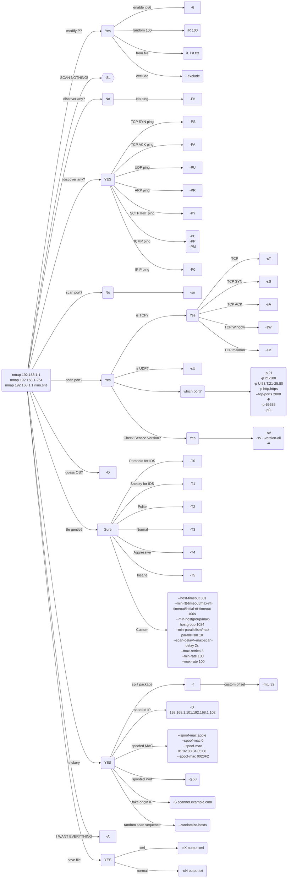

# nmap 

nmap offical reference guide: https://nmap.org/book/man.html

Offical Doc : https://nmap.org/book/man.html
Offical Doc CN : https://nmap.org/man/zh/index.html
Offical Doc JP : https://nmap.org/man/ja/

Cheat Sheet by *Nathan House* https://www.stationx.net/nmap-cheat-sheet/

# Macros (WIP)


```bash
#Stay low (IDS Evasion command)
nmap -f -t 0 -n -Pn –data-length 200 -D 192.168.1.101,192.168.1.102,192.168.1.103,192.168.1.23 192.168.1.1
#Get target OS and ports
nmap -sS -P0 -sV -O <target>
#Find every host under a LAN MASK
nmap -sP 192.168.0.*
#Batch Ping 
nmap -sP 192.168.1.100-254
#Count Win/Linux devices
sudo nmap -F -O 192.168.0.1-255 | grep “Running: ” > /tmp/os; echo “$(cat /tmp/os | grep Linux \
| wc -l) Linux device(s)”; echo “$(cat /tmp/os | grep Windows | wc -l) Window(s) device”
#Find unused IPs
nmap -T4 -sP 192.168.2.0/24 && egrep “00:00:00:00:00:00″ /proc/net/arp
```


# Cheat Sheat

