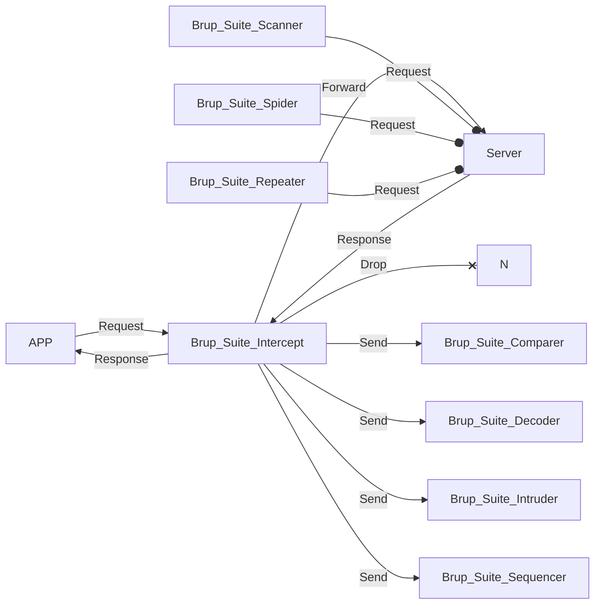
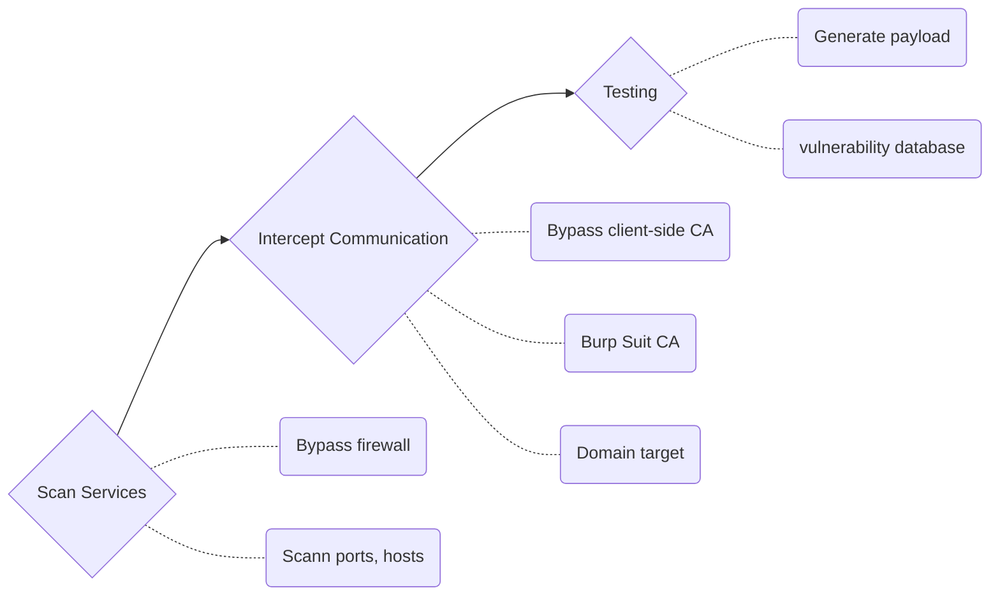
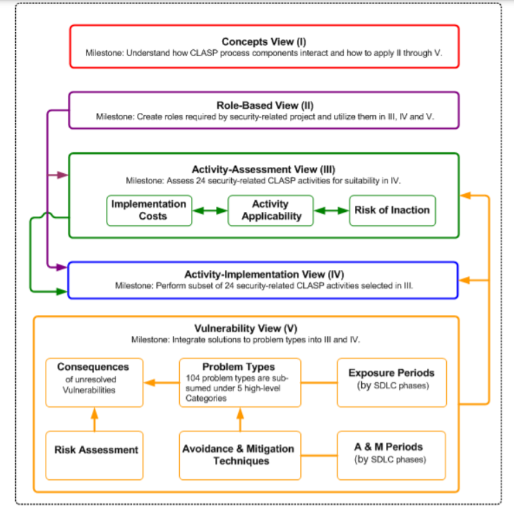

### Outline

### Computer network

- HTTP

- HTTPS

- UDP/TCP

- Proxy

- ports and IP

### nmap

- Scan IP in selected scope

- Scan IP randomly

- Scan DNS address

- Scan IP only

- Scan UDP Service only

- Check specific ports' status

- Load scripts

- Zenmap GUI

- Nmap Cheat Sheet

### Burp Suite 

#### Practice

- [nmap](https://riino.site/2021/11/25/nmp.html) practice

- brup practice

- google hacking practice

- firece & thehavester learning

- SQLmap learning

- netcat learning

#### Vulnerability Knowledge

#### Unsecure mechanism

Login; Logout; CAPTCHA ; Directory; Local File Vulnerability; Remote file Vulnerability ; File Inclusion Vulnerability

#### Session Management Testing

HTTP Only scenario; Secure Cookies; Session Fixation; CSRF; Bypass anti-CSRF;

#### Input Validation Testing

CSS Attacks

- Reflected
- Stored
- DOM-based

SQL injection 

- In-band SQL injection

  - Error-based

  - Union-based
- Blind SQL injection

  - Boolean-based

  - Time-based
- Out-of-band (OOB) SQL injection
- Automation
  - Commix

- Command Injection
- XML/XPATH Injection
- PHP Code Injection

#### CVE/CWE Cases

- Druppal SQL injection CVE-2014-3704

- SQLite Manager File Inclusion CVE-2007-1232

- SQLite Manager XSS CVE-2012-5105

- Heartbleed CVE-2014-0160

- HTML5 Insecure local storage CWE-922

- ShellShock CVE-2014-6271

### OWASP

### MS-SDL

https://www.microsoft.com/en-us/securityengineering/sdl/practices

### Pen-testing

#### Mobile Testing

- [MobSF](https://github.com/MobSF/Mobile-Security-Framework-MobSF) learning/code reading

- Pithos

- Frida

- iOS Jailbreak knowledge

- Android smali scirpt editing

- iOS client-side server CA

- android client-side server CA

- Bypass proxy CA issue

#### Hacking

Generate payload using metasploit

OWASP Mobile 10

- [M1: Improper Platform Usage](https://owasp.org/www-project-mobile-top-10/2016-risks/m1-improper-platform-usage)
- [M2: Insecure Data Storage](https://owasp.org/www-project-mobile-top-10/2016-risks/m2-insecure-data-storage)
- [M3: Insecure Communication](https://owasp.org/www-project-mobile-top-10/2016-risks/m3-insecure-communication)
- [M4: Insecure Authentication](https://owasp.org/www-project-mobile-top-10/2016-risks/m4-insecure-authentication)
- [M5: Insufficient Cryptography](https://owasp.org/www-project-mobile-top-10/2016-risks/m5-insufficient-cryptography)
- [M6: Insecure Authorization](https://owasp.org/www-project-mobile-top-10/2016-risks/m6-insecure-authorization)
- [M7: Client Code Quality](https://owasp.org/www-project-mobile-top-10/2016-risks/m7-client-code-quality)
- [M8: Code Tampering](https://owasp.org/www-project-mobile-top-10/2016-risks/m8-code-tampering)
- [M9: Reverse Engineering](https://owasp.org/www-project-mobile-top-10/2016-risks/m9-reverse-engineering)
- [M10: Extraneous Functionality](https://owasp.org/www-project-mobile-top-10/2016-risks/m10-extraneous-functionality)

#### SSDLC

- Development lifecycle

- Requirement -> Architecture -> Test Planning -> Coding -> Testing（CICD）-> Release

- SSDLC Framework

- NIST 800-64

- MS SDL

  - Provide Training

  - Define Security Requirements

  - Define Metrics and Compliance Reporting

  - Perform Threat Modeling (e.g. STRIDE)

  - |         Threat         | Desired property  |
    | :--------------------: | :---------------: |
    |        Spoofing        |   Authenticity    |
    |       Tampering        |     Integrity     |
    |      Repudiation       | Non-repudiability |
    | Information disclosure |  Confidentiality  |
    |   Denial of Service    |   Availability    |
    | Elevation of Privilege |   Authorization   |

  - Establish Design Requirements

  - Define and Use Cryptography Standards

  - Risk of 3-rd Components Management

  - Use approved tools

  - Static Security Testing (SAST)

  - Dynamic Security Testing (DAST)

  - Penetration testing

  - Establish Standard Incident Response Process

- OWASP CLASP

  

#### Anti-Sql injection in development

#### Anti-XSS 

#### Anti-CSRF

#### Anti-Code injection

- XPath
- Json