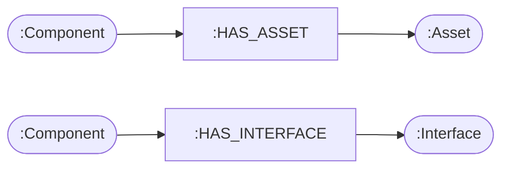
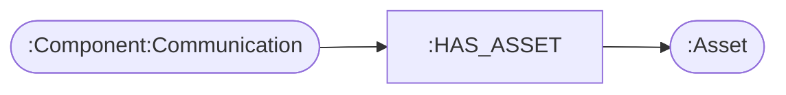
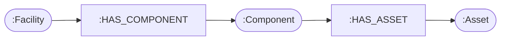
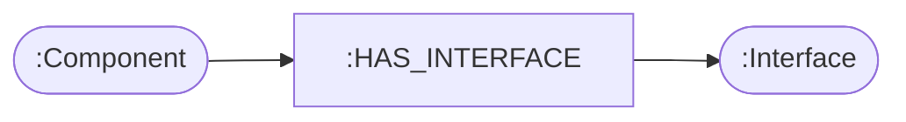
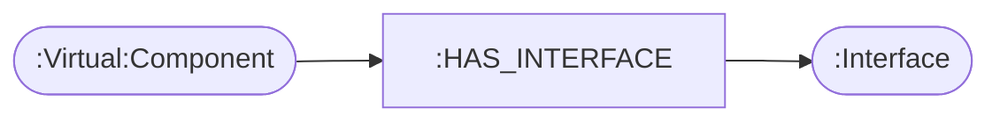
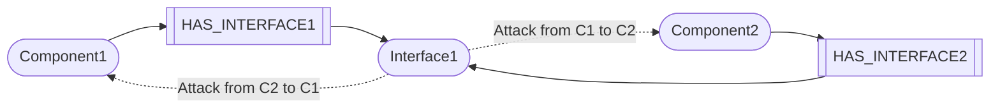
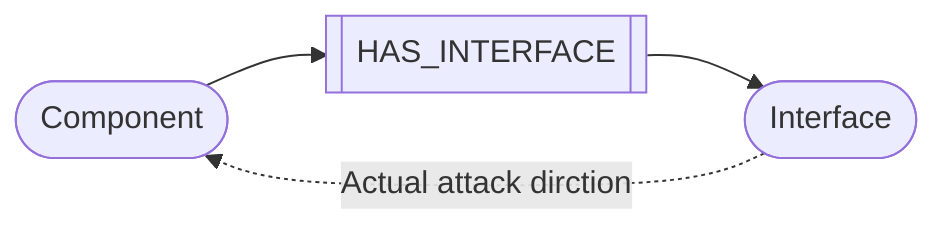
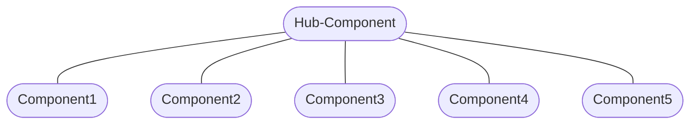
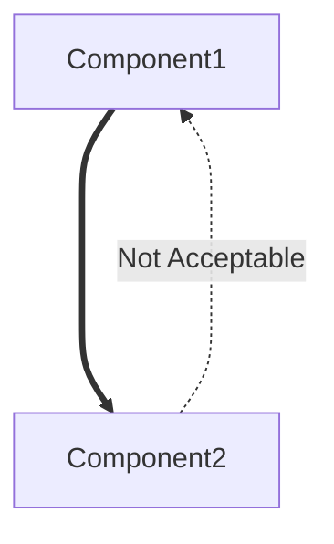

# Threat Modeling using Neo4j Graph Database[Draft]

> THIS VERSION IS FOR RIINOSITE USAGE

Author : Riino Shiqi Zhang, Cyber White Hat Team

## Abstract

In this guidance, we will introduce a threat modeling technique that was used in a real project in 2021, as a part of assessment result for an experimental L4 autopliot system from an automobile maker , where we converted the real world network tropology into digital twin in graph database with given principles , quantified by CVSS 3.1  to formalize a **Threat Modeling Graph(TMG)**. Based on this graph, a conditional traversal that search every possible attack chain can be made to try to simulate , assess and quantify risk under STRIDE model. There are some benefits that we would like to share to explain the reason why we use graph database and why we combine threat modeling and graph technique together:

- **Time-saving** : As the final output, the traversal algorithm generates over 120k possible attack chains, with different type of STRIDE, calculated multi-step attack CVSS scores.  Therefore we can quickly confirm the most risky scenarios via descending sorting, which saves lots of time.
- **Operation-saving**: As for the input, our team can only maintain the list of entry-point, devices and servers. During the analysis, we can extract every relationships generated out of the database and generate a excel file to let us give CVSS scores for each relationships, with some rules that we designed.
- **Visualization**: Graph structure provides us huge advantages that we can visually check the entire database to see if there is any mistake, and we can easily maintain a complex network topology and share it with others.
- **Agile**: The entire system can be updated very quickly by just updating all input excel files and run the scripts again, in another word, by simply updating few rows, we can update entire output with over 120k records.

Additionally, the core motivation of using graph is that we can create a digital twin of the entire environment, and use graph as a powerful media from defenders' perspective and gain advantages on the coverage, efficiency, and intuition during threat modelling procedure.

## Preface

Kindly keep it in mind that due to NDAs and other policies in the company, this  will not disclose any confidential information, personal information, or and information that can disclose the details of the project and the client , including the name of client or the basic information about the system.

The main intention of writing is to present a brief guidance on how to implement a simple TMG and use it for threat modelling. In this guidance, we will use **Python** and neo4j **Cypher** language for demo scripts. However, most concepts will be presented as mathematical formulas and diagrams. Therefore you can choose any other alternatives to implement same concepts, including TMG.

## 1. Introduction

### 1.1 Basic Concept of TMG

The threat modeling procedure works from defenders' perspective. The main reason of using graph is that we would like to demonstrate a visualized and intuitive overall status of a system, which is a network tropology, in most cases.

The TMG shares same idea as to use graph database to store components involved in the scope of analysis to clearly shows what components can be attacked.  Here is a **Knowledge Graph** from neo4j's:


<center>Fig. 1: A sample cybersecurity knowledge graph from neo4j</center>

Compared with knowledge graph, the TMG contains less in demonstration the real access network but more isolated potential entry points as individual nodes in the graph. Besides, relationships (i.e. the connection between nodes) represent CVSS rating in certain attack direction via property feature. Based on the type of nodes linked, there could be bidirectional or unidirectional attack(s). We will explain this in **section** **2.4**.


<center>Fig. 2: The basic concept of TMG with a simple C/S structure </center>

### 1.2 Node Types

You may notice that there are three types of `node`s  in a TMG with different color, they are `interface` , `component` and `asset`:

- `interface` : represents an entry-point that a attacker can utilize, and try to attack the component it refers to, like a USB port, a LAN port, or an available terminal that attacker can type commend in. In the demo above, the green nodes are the interface node.
- `component`: represents a device(can be physical or virtual) that can contain assets, like a computer, cloud VM, a edge-computing board, or any device that can be **hacked** (i.e. partially controlled by attackers)
- `asset`: could be digital asset like running application with data, running database, or physical asset, like hard drive, etc.

Using Cypher language, the structure of these nodes can be represented as:

```cypher
(:Component)-[:HAS_ASSET]->(:Asset)
(:Component)-[:HAS_INTERFACE]->(:Interface)
```
And the corresponding graph is :


Besides, you may notice that the network node above contains a purple outline, which means it is also a `communication component`, it could also have an `Asset`, depends on if you desire to protect this communication channel and regard itself as a part of your asset.

A communication node must be a component, we can use multi label feature in neo4j to easily represent this:

```cypher
(:Component:Communication)-[:HAS_ASSET]->(:Asset)
```



Moreover, if the system is complex, we recommend to use category concept by using `facility` nodes:

```cypher
(:Facility)-[:HAS_COMPONENT]->(:Component)-->[:HAS_Asset]->(:Asset)
```



Therefore you can easily query all components that belongs to certain facilities, here is a demo shows the interface result, grouped by facility, which we will use later to connect interfaces. 

```cypher
MATCH (f:Facility)
WITH f
MATCH (f)-[:HAS_COMPONENT]->(:Component)-[:HAS_INTERFACE]->(i:Interface)
RETURN i as interface ,f as facility
```

<center>Script 1 : Query all interface nodes and facility nodes</center>

About how to generate these nodes, please refer to **section 2.2** and **section 2.3**.

### 1.3 Attack Chain

The final output will be a connected graph and every path from given two nodes in this graph is a sequence with **alternate** interface nodes and component nodes. Therefore the node list from any attack chain will be :
$$
S=\{i_1,r_1,c_1,i_2,r_2,c_2,...,i_n,r_n,c_n\ |\  i_i\in Interface,c_i\in Component,r_i\in HAS\_INTERFACE \} \tag 1
$$

<center>Eq. 1 Definition of TMG Attack Chain </center>

The equation above will be used to calculate the final risk rating for a given path, we will expand this concept in **section 3.1**

## 2. Graph Initiation

### 2.1 Overview

In this section, we will introduce how to build a TMG from scratch, there are 3 major steps where different input is required:

1. **Create Component-Asset Trees**

   In this step, **a list of asset** is the input, and the goal is to create a tree structure demonstrating the relationships of facilities, components and assets.

2. **Create Interface Nodes**

   In this step, we need a table of **interface mapping** to create all interface nodes, and if the input is correct, we will get a **connected graph** (i.e. *there is a path from any point to any other point in the graph, wolfram*)

3. **CVSS Rating**

   After the topology structure is complete, we need to give a CVSS rating in every possible attack with a given direction, with some specific rules we defined. This will help us calculate the shingle-step & multi-step attack rating eventually.

After initiation of TMG, we can easily use **traversal and filter** technique with selected STRIDE pattern to get threat modelling result, we will introduce  **traversal and filter** methods in next section.

### 2.2 Create Component-Asset Trees

Based on the C/S model above, from the defender's view , the possible assets could be presented from this table:

| Facility    | Component       | Asset    | Rating: Security | Rating: Operation | Rating: Tech | Rating: Compliance |
| ----------- | --------------- | -------- | ---------------- | ----------------- | ------------ | ------------------ |
| Data Center | Server          | DB       |                  |                   |              |                    |
| Data Center | Server          | Backend  |                  |                   |              |                    |
| Client      | Client Computer | Frontend |                  |                   |              |                    |

<center>Table 1 : Input - Asset List</center>

Take all facilities as the roots of tree we would like to create later, the final output of this step will be a collection of trees:


<center>Fig. 3: Three-layer forest structure from asset list input </center>

To accomplish this, we need to read the table by line, and save the data of each line into a mapping as `asset_prop`, and call the function below:

```python
def update_asset_into_db(session,asset_prop):
    def _cypher(tx, asset_prop):
            return list(tx.run(
                '''
                MERGE (facility:Facility {name: $facility_name })
                MERGE (component:Component {name: $component_name })
                MERGE (asset:Asset {name: $asset_name, asset_id : $id, security : $security ,operation : $operation, tech : $tech , compliance : $compliance, des : $des})
                MERGE (facility)-[has_component:HAS_COMPONENT]->(component)
                MERGE (component)-[has_asset:HAS_ASSET]->(asset)
                RETURN has_component,has_asset
                ''', {'facility_name': asset_prop['facility_name'] , 
                      'component_name': asset_prop['component_name'],
                      'asset_name': asset_prop['asset_name'],
                      'id': asset_prop['id'],
                      'security': asset_prop['security'],
                      'operation': asset_prop['operation'],
                      'tech':asset_prop['tech'],
                      'compliance':asset_prop['compliance'],
                      'des':asset_prop['description']
                     }
            ))
	result = session.write_transaction(_cypher,asset_prop)
	return result
```

<center>Script 2 : Build Faclility-Component-Asset Tree</center>

If you are not familiar with python and cypher, the script above contains these main steps:

1. Create/Update(if it already exists) a facility node, with a given name.
2. Create/Update(if it already exists) a component node, with a given name.
3. Create/Update(if it already exists) an assert node, with a given name and properties. 
4. Create an unidirectional relationship between the facility node and the component node.
5. Create a unidirectional relationship between the component node and the asset node.

**Notes:**

- **Make sure your input is correct and compatible with the script.**

- **It's important to regard communication facilities as your component and identify corresponding assets.**

  

### 2.3 Create Interface Nodes

In this step, we will create corresponding interface nodes, and set correct relationships `HAS_INTERFACE`, once this step is done, you should get a Connected Graph, otherwise, it means your system can be divided into smaller systems and can be analyzed separately. 

Before doing that, let's hide facility nodes and asset nodes for now, and focusing on component nodes. To accomplish that, there are two parts during this step:

1. Create interface nodes for each existed component nodes.
2. Create **virtual component nodes** to connect two interface nodes depending on situation in real world.

The Basic idea is to create such relationships in graph database:

```
(:Component)-[:HAS_INTERFACE]->(:Interface)
```



or, in the case of virtual component, an extra label is used:

```
(:Virtual:Component)-[:HAS_INTERFACE]->(:Interface)
```



Firstly, we need to prepare the mapping table as below, the component column can be generated by query all component nodes in database:

```cypher
MATCH (n:Component) RETURN n
```

<center>Script 3 : Query all Component Nodes</center>

And we have to enter the corresponding interface column, to let the script know what interface to create. In neo4j, though the name property of `Component` nodes is same, the neo4j will still create nodes with different UIDs. So keep it in mind that you have to design the principle of naming interface nodes and the way you use Cypher directives.(MATCH/MERGE)

| Component             | Interface                  |
| --------------------- | -------------------------- |
| network:Communication | Gateway1,Gateway2,Internet |
| Server                | Gateway1                   |
| Router                | Gateway2,LAN1              |
| Client Computer       | Terminal,LAN2              |

<center>Table 2 : Input - Interface Mapping (1/2)</center>

You may notice that we would like to connect two interface 'LAN1' and 'LAN2' here since they are connected physically in real world. In this case we have to create a **virtual component** with 2 labels, "Component" and "Virtual". The latter one is used for skip traversal later since it is not a real component with assets. Therefore, we have to add extra information in the table above:

| Component                      | Interface |
| ------------------------------ | --------- |
| Virtual-Router-Client-Computer | LAN1,LAN2 |

<center>Table 3 : Input - Interface Mapping (2/2)</center>

After completing Component-Interface mapping table, we can read this mapping and create interface node or virtual-component nodes by reading this table by line, and for each component and interface, here is a sample of python script showing how to create corresponding nodes and relationships.

```python
def create_interface(session,component_name,interface_name):
    def _cypher_virtual_component(tx,component_name,interface_name):
        return list(tx.run(
        '''
        MERGE (i:Interface {name : $interface_name})
        WITH i
        MERGE (c:Component:Virtual {name : $component_name })
        WITH c,i
        MERGE (c)-[r:HAS_INTERFACE]->(i)
        RETURN r
        ''', {'interface_name': interface_name , 'component_name': component_name }
        ))
    def _cypher_create_interface(tx,component_name,interface_name):
        return list(tx.run(
        '''
        MERGE (i:Interface {name : $interface_name})
        WITH i
        MERGE (c:Component {name : $component_name })
        WITH c,i
        MERGE (c)-[r:HAS_INTERFACE]->(i)
        RETURN r
        
        ''', {'interface_name': interface_name , 'component_name': component_name }
        ))
    if str(component_name).startswith( 'Virtual' ):
        result = session.write_transaction(_cypher_virtual_component,component_name,interface_name)
    else:
        result = session.write_transaction(_cypher,component_name,interface_name)             
    return result
        
```

<center>Script 4 : Create Interface Nodes and Necessary Virtual Nodes</center>

Once you finished this step, your graph in database should become a connected graph, and this allows us to use graph traversal to simulate any possible attack chain automatically.

**Notes:**

- **Make sure your input is correct and compatible with the script.**

- **The ultimate goal is to build a digital twin under real world basis. If you would to exclude some component in your asset scope, you can add another layer of label like 'EXT', and skip nodes with this label later.**

### 2.4 CVSS Rating

#### **Definition**

This is the last step before doing graph traversal. In this section, there are two major works:

- Query all `HAS_INTERFACE` relationships, which represents a certain unidirectional attack channel.
- Institute a CVSS rating for each relationship, and update these information back to graph database.

To simply query all relationships, use the script below:

```cypher
MATCH p = (c:Component)-[r:HAS_INTERFACE]-(i:Interface) RETURN p
```

<center>Script 5 : Query all HAS_INTERFACE relationships</center>

Assuming for a given relationship $r$ , with a certain STRIDE type $\mathcal T$, the CVSS property should be a collection:
$$
\{p_\mathcal{T} |p\in(0,10),\mathcal T\in \{S,T,R,I,D,E\}\} \tag 2
$$

<center>Eq. 2 : Attack Vector Property </center>

For example, for a certain relationship `Terminal->Client-Computer` , we may have a corresponding $p_E$ = CVSS:3.1/AV:P/AC:H/PR:H/UI:R/S:C/C:H/I:H/A:H = 6.8, where $E$  means '**Elevation of Privilege**' attack.

Additionally, we can also initialize that $p_D$  = CVSS:3.1/AV:P/AC:L/PR:L/UI:R/S:U/C:N/I:H/A:H = 5.7 , where $D$ means '**Denial of Service**' attack.

#### **Direction**

You may notice that the direction is an issue, when setting the CVSS scores, especially under the case of virtual components. 

We define the attack direction is the reversed direction of `HAS_INTERFACE`. The diagram below shows how `HAS_INTERFACE` is used to contain the attack CVSS data cross components. (i.e. attack hacked a component, and try to attack next component via current one.)



Besides, this principle allow us to align the scenario where attack try to hack a component via its interface:



Therefore we can unify the rules of judging the directions for both scenario: **cross-component** and **interface-to-component** by such definition.

## 3. Threat Modelling

### 3.1 Overview

In this section, we are going to compute the risk rating score for any logical attack chain, defined by *equation 1*, where the final score $R$ can be calculated by **multi-step attacking rating** methods:
$$
P_\mathcal T=\prod p_i \times 10^{1-i}, where\;p_i\in \{ \enspace  {p_\mathcal T}_{r_i}|r\in S\},\;\mathcal T\in\{S,T,R,I,D,E\} \tag 3
$$

<center>Eq. 3: Overall Risk Probability Calculation </center>

Besides, we can get a series certain threat modelling attack description in such format:

The final table's column information as the delivery of TMG could be :

| Column Name              | Description                                                  |
| ------------------------ | ------------------------------------------------------------ |
| Index                    | UID of threat description                                    |
| Facility                 | Facility node name                                           |
| Component                | Component node name as the parent node of target             |
| Asset                    | Analysis target node                                         |
| Rating: Security         | Asset rating in security aspect                              |
| Rating: Operation        | Asset rating in operation aspect                             |
| Rating: Tech             | Asset rating in technology aspect                            |
| Rating: Compliance       | Asset rating in compliance aspect                            |
| Attacker Type            | Could be internal user, external user or 3rd attacker        |
| Attack Period            | When  the system is on/off, or a certain time period when the attack could be performed |
| First Entry-Point        | The first interface node name                                |
| Influence                | What influence could be made (asset get damaged/stolen, etc.) |
| Full Description         | Full description text                                        |
| STRIDE Type              | Attack type, e.g. DoS                                        |
| Attack Vector (AV)       | Overall AV, could be a hybrid answer.                        |
| Attack Complexity (AC)   | Overall Complexity                                           |
| Privileges Required (PR) | Whether privileges are required during entire attack         |
| User Interaction (UI)    | Whether user interaction is required during entire attack    |
| Probability              | $P_T$ , defined by equation 3                                |
| Rating                   | Could be High/Medium/Low, depends on Probability.            |

<center>Table 4 : Output - Table Header Sample</center>

Where the Full Description above could be :

**Direct Attack Scenario:**

`WHO` during `WHEN`, attacks `Component` from `Interface`, accomplish `attack_type` towards `Asset` of `Component`, risk rating is `rating`.

**Multi-step Attack Scenario:**

`WHO` during `WHEN`, `Description_of_sub_attack`, `Asset` of `Component` gets `attack_type`, risk rating is `rating`.

### 3.2 Graph Traversal

According to the `[…]` directive from neo4j, we can query any connected path under the condition of length with two given nodes. By using this technique, we can simply accomplish our traversal in code below:

```python
def get_path_from_asset_to_interface(session,asset_id,interface_name):
    if not interface_name or not asset_id:
        cprint('asset_id or interface is null')
        print(interface_name, '--', asset_id)
        return -1
    def _cypher(tx):
        return list(tx.run(
        '''
        MATCH (c:Component)-[:HAS_ASSET]->(a:Asset{asset_id: $asset_id})
        MATCH (i:Interface {name: $interface_name})
        WITH c,i
        MATCH p=(c)-[:HAS_INTERFACE*..13]-(i)
        RETURN p
        ''',{'asset_id': asset_id , 'interface_name': interface_name}
        ))
    path = session.read_transaction(_cypher)
    return path
```

<center>Script 6 : Graph Traversal, core technique of TMG</center>

The script below will bring our all possible attack chain. Notice that we defined the max length of path as 13 at the line 12, which can be adjusted to actual requirements. Besides, the returned path does not contain our final nodes for any attack chain, which is the asset node. Therefore the `p` here is exactly the set of $S$ defined in *equation 1*. We can use iteration operation to this set and calculate the $R$ of each path.

### 3.3 Path Filter

Notice that NOT every path between two given nodes is reasonable. The reason could be either the attack path doesn't make sense, nor some component node doesn't allow the attack to pass towards certain direction(i.e. next node).

There are several filter methods that we used:

**Exclude Certain Directions in Hub Structure**

Assuming there is a hub structure(i.e. Star Topology) under the view of component nodes only:



And you don't want to accept certain direction across the hub, like C1-Hub-C2, or C1-Hub-C4, which means that if attacker hacked hub component from Component1, he can not move on towards Component2 or Component4. 

**Exclude Unreasonable Unidirectional Attacks**

Assuming that only certain attack direction across components can be accepted, with basis of real world situation. e.g. Attackers can hack a salve device once he got the master server, but for some reason he can not hack the master server once he hacked the salve device:



**The Solution: Detect Certain Sequence Appeared**

In both scenarios, we can **ban certain sequence** appears in attack chains we get. There are many approaches to implement this, for example, you can save a string by concatenating the components' names, declare certain banned sequence's corresponding string, like 'Component1|Hub-Component|Component2' and then use `contains` to check if such sub-string exists.

## 4. Future Works

### 4.1 **Performance Issue**

Due to the technology stack we use (Python+neo4j), the performance of script will drop if a)Huge results of traversal since the graph is complicated. b)Querying lots of nodes (over 100 nodes) because of the inherited complexity of graph structure (actually, the graph in neo4j is saved as B-tree), and the low velocity of Python. Currently we recommend adding **index** into component nodes to remediate query time cost during path traversal, and there are two more strategy that may help improve the performance:

You may notice that the function in **Script 6** can be executed under parallel computing, since there is no **Write** operation. However, we haven't test this yet and do not know if there is any side-effect.

### 4.2 **Optimized  Max-length Value**

In our demo, we set the max-length of path as 13. Let's define the max-length as $M$ . $M=13$ is only suitable for our dataset. To figure out the best threshold, the first condition is the path that contains lots of component might be ignored eventually, since the attacker have to hack lots of components. 

To get the best threshold, we can operate a reversed work, where we may adjust max-length parameter via a given minimum value of acceptable $P_{\mathcal T_{min}}$ , defined as $P_\mathcal T'$ , which is our ideal threshold of probability.  Now define $\mathbb{S}(M_i)$ is the result of paths, with given 2 nodes and a fixed path length $i$, and the $f(M_i)$ is the final result, with a given max-length $M_i$:
$$
P_{\mathcal T_{min}}=f(M_i)=\min ( \mathbb{S}(M_1)\cup\mathbb{S}(M_2)\cup...\cup\mathbb{S}(M_i)) \tag 4
$$
Then we can get the $M'$ is the output of $f^{-1}$ with a given $P'_\mathcal T$ :
$$
M'=f^{-1}(P'_\mathcal T) \tag 5
$$


## Reference

- *[White Paper of Graphs for Cybersecurity](https://neo4j.com/blog/graphs-for-cybersecurity/)* by Dave Voutila , Gal Bello, Tara Jana(TJ) ,and Deb Cameron.
- [Common Vulnerability Scoring System version 3.1: Specification Document](https://www.first.org/cvss/v3.0/specification-document)
- [Microsoft Threat Modeling Tool : STRIDE](https://docs.microsoft.com/en-us/azure/security/develop/threat-modeling-tool)

