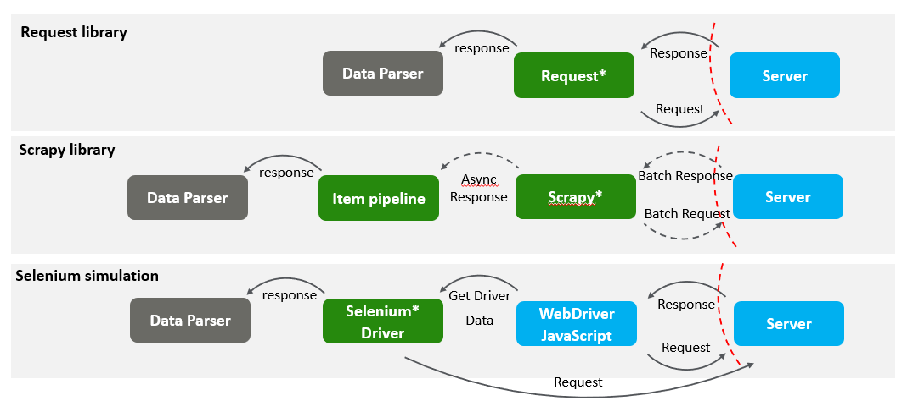
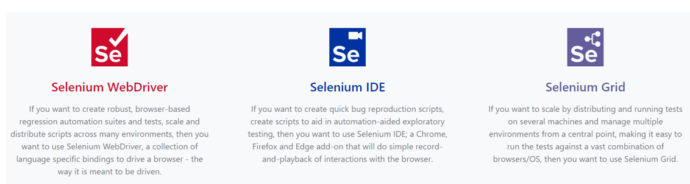

Notes: This article is meant to be a brief introduction of web crawler for those who may have no technical background, and no detailed technical implementation or development will be included.

And we will also provide legal and regulation summary for web crawler (mainly in P.R.China Region), this is written for those who would like to utilize crawler, develop a crawler or manage crawlers.

## 1/3 Business Background and Main-stream Tech Implementation

### Overview

Crawlers generally refer to the technical means of automatically requesting resources on the Internet in bulk using automated tools (e.g. self-developed python scripts) and storing and analyzing the obtained content for the purpose of obtaining specific data collection. Crawlers are divided into two categories in terms of data usage purposes, search engine crawlers (used only to generate search engine knowledge graphs) and data capture crawlers. This material discusses only the implementation techniques, corresponding anti-crawler measures and legal constraints for the latter type of crawlers.

The following resources are usually the targets of crawlers:

- There exist a large amount of social engineering data and information platforms with **aggregation analysis value**: travel software, ticket booking platforms, shopping websites . By crawling data and aggregation analysis in large quantities, we can study people's travel or shopping characteristics.
- **Social networking sites**, such as Weibo, Zhihu, Twitter, LinkedIn, Facebook, etc. By crawling a large number of crawlers, we can obtain the characteristics of social content, such as the sentiment tendency and the frequency-timing relationship of sending letters for a hot topic, the activity of specific accounts and media influence analysis, etc.
- **Knowledge databases**. For example, movie rating sites, news sites, image material sites, music sites. By crawling such sites, crawlers can obtain corresponding resources, perform data analysis, or subscribe to such sites' updates, for example, by creating news subscriptions for a certain keyword.

Crawler activity usually consists of the following phases.

1. **Content request**: the user makes a request for a web resource through an automated tool.
2. **Content parsing**: The user parses the obtained web resources, such as html file structure, through parsing tools to extract useful data.
3. **Content storage and analysis**: The user stores the crawled data through file storage, Sql database or NoSql database, and analyzes it with other data analysis or visualization tools. Such as PowerBI, etc.

> Generally speaking, websites will welcome crawlers under certain scopes and use cases, and may also try to reject crawlers within specific channels of information provision. This depends on the type of data contained on the site itself, and how the site's owner wants users to access their data. **In theory, any data that can be displayed on a website can be crawled. **At the same time, crawlers face both **legal and technical ethical** restrictions.

### Content Request

Some programming languages provide web request libraries, such as Python's Request library, Scrapy and Selenium libraries that are able to achieve the relevant results. They initiate a GET request to the target url and save the returned content (which may be in html, json or other formats). The following shows the basic structure of the crawler implemented by the three frameworks.

#### Selenium

Selenium is a browser automation testing framework(actually it is a web browser running core ) that allows the use of programming languages (Java, Python) or other means to control a basic browser driver (WebDriver) capable of loading pages and running JavaScript scripts.**Selenium WebDriver + Python** is the most common way to use it. allowing crawler users to seamlessly link Selenium to simulate browser launch and data parsing operations.

Selenium is unique in its ability to run fully realistic page loading and rendering, and to implement realistic user actions. **This makes Selenium the ultimate choice of crawler framework.**

## 2/3 The legal constraints  in China

**The scope of data acquisition by crawlers**: Since the essence of crawlers is to simulate users' browsing to make requests to the Internet, theoretically, crawlers can acquire any data that can be obtained through legal and compliant channels. In addition, crawlers can also obtain data that normal users do not need to obtain (i.e., data unrelated to business), such as the details of parameters returned by website APIs.

**Requests of crawlers**: In general, the requests of crawlers to the Internet have the same permissions as the requests of normal users.

**Situations where there is a risk of common violations of the law.**
Attempts to request protected data, such as crawling confidential information, dragging libraries, etc. (In addition to crawlers, manual access to such information is also a violation of the law)
Crawling data beyond the scope of the site's user regulations, such as crawling the entire content of the site, and downloading resources in large quantities beyond normal usage.
Improper use of crawled data: such as selling and trafficking crawled data, directly or indirectly assisting others to commit illegal acts, etc.
Crawling behavior invades the internal system, makes the system downtime and abnormal operation.

**Relevant laws.**
Based on the above, crawling behavior may be in violation of the law.

### Two Illegal Scenarios

1. Crawling behavior involving **important facilities, commercial secrets, and personal information** may be suspected of being illegal

**Criminal Law of the People's Republic of China**

> Article 253 Violation of the relevant provisions of the state, selling or providing **personal information** of citizens to others, the circumstances are serious, shall be sentenced to fixed-term imprisonment or detention of up to three years
>
> Article 285 Violation of state regulations, intrusion into the **state affairs, national defense**
> Article 285 Anyone who, in violation of state regulations, intrudes into computer information systems in the **fields of state affairs, national defense, or cutting-edge science and technology** shall be sentenced to imprisonment of not more than three years or to
> fixed-term imprisonment or detention

**The Cybersecurity Law of the People's Republic of China**

> Article 44 Any individual or organization shall not steal or otherwise illegally obtain **personal information**, shall not illegally sell or illegally provide personal information to others

**General Rules of the Civil Law of the People's Republic of China**

> Article 111 The personal information of natural persons is protected by law. Any organization and individual need to obtain the **personal information** of others, shall obtain and ensure information security in accordance with the law, shall not illegally collect, use, process, transmit personal information of others, shall not illegally **trade, provide or disclose** the personal information of others.

**Anti-unfair Competition Law of the People's Republic of China  ( AUCL)** 

> Article IX operators shall not implement the following acts of trade secret infringement.
>
> ​        (A) theft, bribery, fraud, coercion, electronic intrusion or other improper means to obtain the **trade secrets** of the right holder.
>
> 　　(B) disclosure, use or allow others to use the previous means to obtain the **trade secrets** of the right holder.
>
> 　　(C) violation of the duty of confidentiality or violation of the requirements of the right to conserve trade secrets, disclosure, use or allow others to use the **trade secrets** in their possession.
>
> 　　(D) abetting, inducing, helping others to violate the duty of confidentiality or violate the requirements of the right to conserve **trade secrets**, access, disclosure, use or allow others to use the right to use the trade secrets.
>
> 　　Operators other than natural persons, legal persons and unincorporated organizations to implement the violations listed in the preceding paragraph, shall be deemed to infringe trade secrets.

2. Crawlers use to cause **downtime losses** also involved in illegal crimes

**Criminal Law of the People's Republic of China**

> Article 286 violation of state regulations, the computer information system functions to delete, modify, add, interfere with the computer information system can not operate normally, with serious consequences, shall be sentenced to fixed-term imprisonment of not more than five years or detention; particularly serious consequences, sentenced to fixed-term imprisonment of more than five years.
>
> Violation of state regulations, the computer information system stored, processed or transmitted data and applications to delete, modify, increase the operation of the serious consequences, in accordance with the provisions of the preceding paragraph shall be punished.

**最高院、最高检《关于办理危害计算机信息系统安全刑事案件应用法律若干问题的解释》(Interpretation of Several Issues Concerning the Application of Law in Handling Criminal Cases Endangering the Security of Computer Information Systems)**

> Article 4
> Damage to the computer information system functions, data or applications, one of the following circumstances, shall be considered as Article 286 (1) and (2) of the Criminal Law "serious consequences": (1) cause more than 10 computer information systems of the main software or hardware can not operate normally; (2) more than 20 (2) more than 20 computer information systems in the storage, processing or transmission of data to delete, modify, increase the operation; (3) illegal income of more than 5,000 yuan or cause economic losses of more than 10,000 yuan; (4) caused for more than 100 computer information systems to provide domain name resolution, authentication, billing and other basic services or more than 10,000 users to provide services for the computer information system can not operate normally for a total of More than 1 hour; (5) cause other serious consequences.

## 3/3 Anti-crawler Methods Overview

#### Why Anti-crawler

Anti-crawler technology refers to a series of means such as a) security reinforcement b) implementation of various strategies against crawlers to increase the technical cost, time cost, and labor cost of crawlers c) protection of data so that it is not easily accessible, etc., so that crawlers can not or difficult to crawl the content of their websites.
Anti-crawlers and laws and regulations restrict crawlers in different ways.

| Before crawler request                                       | After crawler request                                        |
| ------------------------------------------------------------ | ------------------------------------------------------------ |
| Enterprises need to **mitigate risk** before they suffer damage Anti-crawler technology can effectively **reduce malicious crawling** behavior while **improving site usability** Anonymous crawlers may not be able to locate the crawler Laws and regulations alone may not meet enterprise security needs | Laws and regulations do not govern the **intent** of malicious crawlers Only if the crawling behavior **has caused damage** or Only when the corresponding laws and regulations may be applied It is difficult to define the illegality of certain crawling behavior scenarios |

### Anti-crawler technology can be divided into two levels.

- All websites: general security reinforcement for website security, such as setting up load balancing, identity management, code obfuscation, etc. can make it have certain anti-crawling capability.

- Sites with special needs for anti-crawling: implement specialized anti-crawling techniques, such as page obfuscation, honeypot technology, etc.

The strength of the anti-crawler capability deployed generally depends on the importance of the data contained in the website itself.

- **General websites** (without a lot of data), e.g. personal websites, official websites for company presentations): implement basic security hardening, without specifically blocking crawlers.
- **General information websites** (e.g. news websites, knowledge graph websites, encyclopedias, forums): implement certain anti-crawlers, such as login, CAPTCHA, etc., to block malicious crawlers.
- **Important information sites** (travel sites, shopping sites, ticket booking sites): Implement special anti-crawler techniques to block all crawlers.
- **Critical infrastructure** (confidential information database management sites, government service sites): Limit large-scale data requests.

**Why implement different levels of anti-crawling?**

- Properly allowing crawlers can lead to more traffic and attention to the site (for example, allowing access to search engine crawlers will increase the likelihood that the site will be searched for)
- All anti-crawler techniques have a corresponding cost.
- An overly stringent anti-crawler mechanism will affect the user experience (e.g., users may need to type in captchas frequently)

### Mainstream anti-crawler implementation ideas

1. **Request Content Check**

   Check the request source IP.

   Check the request frequency.

   Check the request UA information, the authentication information carried by the request, the check code generated by the front-end, the referer information, the cookie content.

2. **Double-request**

   Require login. Shorten cookie validity, require frequent refresh of login credentials; identify IP and UA, reject One Multi-opening; force OTP login, sweep login, and other ways that bots cannot login on their own.

   Require interaction. Require user to click, drag and drop to display remaining content.

   Require loading. Use JavaScript to request website content twice. Implement iframe nesting and hide src information.

3. **Content Confusion**

   Structure obfuscation. Html tags are packed with random tag name class names. Target url path is randomized.

   Content obfuscation. Use custom fonts to mangle characters. Use front-end code logic to rearrange display content to be inconsistent with data. Use hard-to-parse media such as SVG, 3D models to display data. Image watermarking process to prevent OCR.

