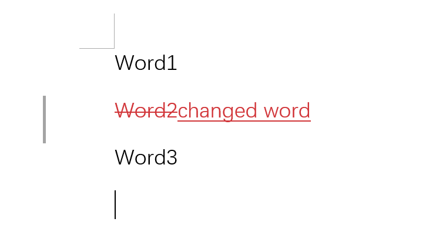

## Python docx

Python [docx](https://python-docx.readthedocs.io/en/latest/) is a library that allows you to read and do **limited** control to doc file.By simply call 'doc', you can convert word file into Document class, which will allow you to get paragraphs and tables. 

The very basic element defined in docx is `run`, which is the basic text container in both table and paragraphs. For example, the code below prints all `run` and you can figure out the structure here:

```python
import docx
INPUT_FILEPATH = 'file.docx'
doc = docx.Document(INPUT_FILEPATH)
print([[run.text for run in p.runs] for p in doc.paragraphs])
#>>[['W', 'ord', '1'], [], ['Word3'], []]
```

You may find that `run` is a compress unite that may contain a part of a single word, a single word or several words.  And some `run` elements seems to have no content here.

## TL;DR： Control everything although docx does not support this

- docx library will only select tags it know (w:p, w:b, w:r, etc.) and will ignore tags it doesn't know (w:ins, w:del, etc.)

- The basic idea of docx is to implement a series 'proxy class' to represent the `<w:p> `  `<w:r> ` etc. , and you can call `element` property to bypass the proxy class to get the actual object, which is a subclass of [_Element](https://lxml.de/api/lxml.etree._Element-class.html) 

- When you do this, you can use methods from `_Element` to do xml operation including `getnext`, `getparent` , `addnext` etc.

- You can also build a `_Element` of your own from string and insert it to certain position located by docx:

  ```python
  def return_a_w_ins_element():
      xml = '''
          <w:ins xmlns:w="http://schemas.openxmlformats.org/wordprocessingml/2006/main" w:author="Leroy Jim" w:date="2018-10-10T14:12:00Z" w:id="1480">
              <w:r w:rsidR="00464094">
                  <w:t> AND ANOTHER CHANGE</w:t>
              </w:r>
          </w:ins>
      '''
      tree = etree.fromstring(xml, parser=etree.XMLParser(ns_clean=True))
      tree = etree.ElementTree(tree)
      return tree.getroot()
  ```

  >  Since there is no 'revision' classes in docx but you can build a `<w:ins>`, convert it into element, and insert it to any proxied element, if you follow rule of ms word.

## Proxy Pattern of docx

Because `docx` has tried to use Proxy Pattern to do wrapper xml nodes behind into classes like `run` and `paragraph`. If we look into the source code, the proxy class of `run` is :

```python
class Run(Parented):
    """
    Proxy object wrapping ``<w:r>`` element. Several of the properties on Run
    take a tri-state value, |True|, |False|, or |None|. |True| and |False|
    correspond to on and off respectively. |None| indicates the property is
    not specified directly on the run and its effective value is taken from
    the style hierarchy.
    """
    def __init__(self, r, parent):
        super(Run, self).__init__(parent)
        self._r = self._element = self.element = r
```

Notice that  `self._r = self._element = self.element = r` will pass value to the real class that wrapping `<w:r>`

```python
class CT_R(BaseOxmlElement):
    """
    ``<w:r>`` element, containing the properties and text for a run.
    """
    rPr = ZeroOrOne('w:rPr')
    t = ZeroOrMore('w:t')
    br = ZeroOrMore('w:br')
    cr = ZeroOrMore('w:cr')
    tab = ZeroOrMore('w:tab')
    drawing = ZeroOrMore('w:drawing')
```

In another word, the docx will wrapper some tabs(just like these tags below) into identified class, therefore, if we try to print the type of `run` :

```python
doc.paragraphs[0].runs[0]
#>><docx.text.run.Run at 0x248dd5bde80>
```

while the actual class behind the proxy can be cited by calling `element` since python will not prevent access to variable inside class:

```python
doc.paragraphs[0].runs[0].element
#>><CT_R '<w:r>' at 0x248dd939310>
```

If you check the type of this object, you can find that it is the `CT_R` below:

```python
type(doc.paragraphs[0].runs[0].element)
#>>docx.oxml.text.run.CT_R
```


## Why We Need to Bypass the Proxy Pattern

If you take a look at the implementation of `CT_R`, you will find that it is a subclass of `BaseOxmlElement`, and let's take a look the implementation of this class:

```python
BaseOxmlElement = MetaOxmlElement(
    'BaseOxmlElement', (etree.ElementBase,), dict(_OxmlElementBase.__dict__)
)
```

When you import `BaseOxmlElement` from docx, the actual class is defined in `_OxmlElementBase` which is a subclass of `etree.ElementBase`

```python
class _OxmlElementBase(etree.ElementBase):
    """
    Effective base class for all custom element classes, to add standardized
    behavior to all classes in one place. Actual inheritance is from
    BaseOxmlElement below, needed to manage Python 2-3 metaclass declaration
    compatibility.
    """

    __metaclass__ = MetaOxmlElement
```

This helps explain why we can use API from https://lxml.de/api/lxml.etree._Element-class.html after getting `element`.

## Take a Closer Look

Docx actually will ignore elements it does not know, for example, if we have a word:



The xml structure under `<w:d>` or `<w:body>` should be :

```
<w:p>
	some <w:r>
	<w:del>
	<w:ins>
	some <w:r>
<w:p>
```

We can do some code to figure it out:

```python
doc = docx.Document(INPUT_FILEPATH)
[[run.text for run in p.runs] for p in doc.paragraphs]
#>>[['W', 'ord', '1'], [], ['Word3'], []]
```

You will notice that only` <w:r>` is got. The first  paragraph has 3 runs, the second one has none, and the last one has 1 run.

But, why is our ins and del nodes gone? We can call '_element' to bypass the proxy and use 'getchildren()' to get nodes, for example, we can get 3 runs from the first paragraph:

```
doc._element.getchildren()[0].getchildren()[0].getchildren()
#>>[<CT_R '<w:r>' at 0x1e9c95a7090>,
#>> <CT_R '<w:r>' at 0x1e9cb3f4130>,
#>> <CT_R '<w:r>' at 0x1e9cb3f4090>]
```

Notice that the docx actually still identified them because there is a 'xml element'->'CT_R'->'Run' transfer.

And when getting children nodes from second 'Blank' paragraph:

```python
doc._element.getchildren()[0].getchildren()[1].getchildren()
#>>[<Element {http://schemas.openxmlformats.org/wordprocessingml/2006/main}del at 0x248dd5c0bc0>,
#>> <Element {http://schemas.openxmlformats.org/wordprocessingml/2006/main}ins at 0x248dd682bc0>]
```

You will notice that these are elements that is not recognized by docx, but you can still get them, and in this situation the class will be `Element`, which is the ins, and del nodes in the word.
