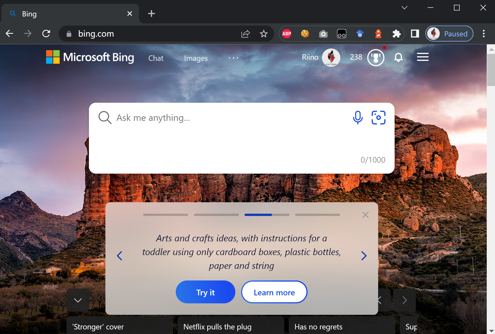

> Warning: This might be a violation of terms of use of new Bing. Since the marking strategy of new Bing is to limit the browser type. Please keep it in mind that this is just a tech validation on *how new Bing check your validation type* . You should understand the risk before using the technique below.

## How new Bing check if you are using Edge

Bing.com will check the `User-Agent` and only check this value to identify if you are using Edge and allow you to access new Bing Chat.

Besides, Bing also check the IP region to identify if your request should be redirected to `cn.bing.com` or` bing.com/cn` , So DO USE PROXY to access Bing:


## Modify Your Request header

Therefore, you can change `x-forwarded-for` to purpose new IP source and modify `User-Agent` to let the server know you are using Edge. There are several tools that allow you to do this. I'm using `head editor`, a chrome plug-in, and the rule is:

```json
{
	"request": [],
	"sendHeader": [
		{
			"enable": true,
			"name": "FakeEdge",
			"ruleType": "modifySendHeader",
			"matchType": "regexp",
			"pattern": "^http(s?)://(.*).bing\\.com/(.*)",
			"exclude": "",
			"group": "Ungrouped",
			"isFunction": false,
			"action": {
				"name": "user-agent",
				"value": "Mozilla/5.0 (Windows NT 10.0; Win64; x64) AppleWebKit/537.36 (KHTML, like Gecko) Chrome/110.0.0.0 Safari/537.36 Edg/110.0.1587.69"
			}
		}
	],
	"receiveHeader": [],
	"receiveBody": []
}
```

## Result

After replace the UA and make sure your access to bing.com are not from China you're good to go:


