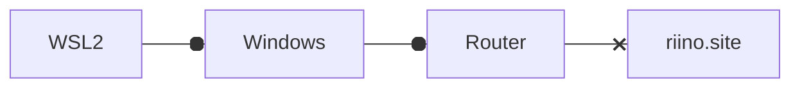
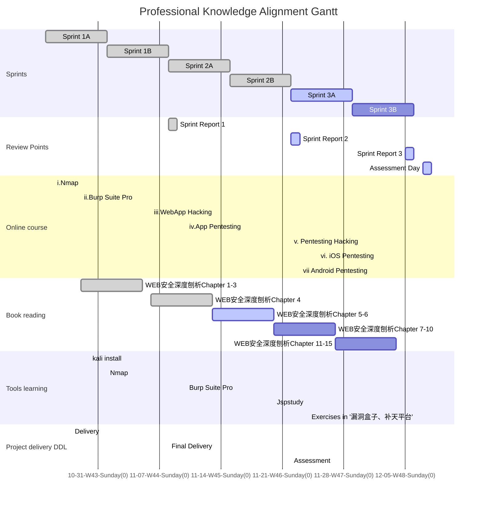

### Foreword

Under the tutelage of Jacob and Justus, this live learning dashboard is our version 2 dashboard of learning plan for the professional knowledge alignment, which is the basic knowledge of pentesting, hacking and the usage of corresponding tools. This page is designed for tracking my learning status and none of busniess information will be disclosed in this website. Besides, their will not be any information of projects in company, or any details of the content of the learning.

The knowledge roadmap(scope) will be based on the book 《WEB安全深度刨析》

Please read this page in **Light mode**, we will add mermaid dark style in next update of jekyll-theme-panda.   <a  onclick="modeSwitcher()" style=" color: #007bff" href="javascript:void(0)">Click here to switch theme. </a>

# Learning Schedule

#### Sprints

Inspired by Scrum, I make 2 weeks as a sprint to arrange what will be done. 

Before each sprint, I will decide what will be learnt and check the progress. In the end of each sprint, there will be a sprint report attached at the end of this page. Each sub-sprint will have 3 states like other works : done, active and todo.

#### Online course

Online course contains 7 online courses with different learning time. A course will be finished when met these two goals: a)Course is finished in learning website; b)Tried related tools in real world.

#### Book reading

To read the book and try the testing tools if needed.

#### Tools learning

Install and run tools in Windows or Kali, and try them in a website(riino.site) and a network(home wifi).  I prepared 2 environments: a) Windows 10 Home 21H1; b) Linux Kali - WSL2 running Win-Kex. In this situation, the network hierarchy will be like this:

#### Project delivery DDL

If meet urgent delivery requirement, there will be a 'delivery' event showing that the bandwidth will decrease in this period.

#### Gantt Chart

Gantt chart will show what I've done and what I'm doing. 

## WBS Status Sheet

Before a sprint some task will be moved out of backlog.

| WBS Name                  | Type           | Status    | Planned Sprint | Actual Sprint |
| ------------------------- | -------------- | --------- | -------------- | ------------- |
| i.Nmap                    | Online Course  | ✅Done     | 1A,1B          |               |
| ii.Burp Suite Pro         | Online Course  | ☑️earning  | 1B             | 2A            |
| iii.Web App Hacking       | Online Course  | ☑️earning  | 1B             | 2A            |
| iv.App pentesting         | Online Course  | 🔲To-do    | 2B             |               |
| v.Pentesting/Hacking      | Online Course  | 🔲To-do    | 2B             |               |
| vi.iOS pentesting         | Online Course  | 🔲To-do    | 3A             |               |
| vii.Android pentesting    | Online Course  | 🔲To-do    | 3A             |               |
| WEB安全深度刨析Chapter 1  | Book Reading   | ✅Done     | 1A             | 1A            |
| WEB安全深度刨析Chapter 2  | Book Reading   | ✅Done     | 1A             | 1A            |
| WEB安全深度刨析Chapter 3  | Book Reading   | ✅Done     | 1A             | 1B            |
| WEB安全深度刨析Chapter 4  | Book Reading   | ✅Done     | 1B             | 1B            |
| WEB安全深度刨析Chapter 5  | Book Reading   | ☑️Learning | 1B             | 2A            |
| WEB安全深度刨析Chapter 6  | Book Reading   | 🔲To-do    | 2A             | 2A            |
| WEB安全深度刨析Chapter 7  | Book Reading   | 🔲To-do    | 2A             | 2A            |
| WEB安全深度刨析Chapter 8  | Book Reading   | 🔲To-do    | In Backlog     |               |
| WEB安全深度刨析Chapter 9  | Book Reading   | 🔲To-do    | In Backlog     |               |
| WEB安全深度刨析Chapter 10 | Book Reading   | 🔲To-do    | In Backlog     |               |
| WEB安全深度刨析Chapter 11 | Book Reading   | 🔲To-do    | In Backlog     |               |
| WEB安全深度刨析Chapter 12 | Book Reading   | 🔲To-do    | In Backlog     |               |
| WEB安全深度刨析Chapter 13 | Book Reading   | 🔲To-do    | In Backlog     |               |
| WEB安全深度刨析Chapter 14 | Book Reading   | 🔲To-do    | In Backlog     |               |
| WEB安全深度刨析Chapter 15 | Book Reading   | 🔲To-do    | In Backlog     |               |
| WEB安全深度刨析Chapter 16 | Book Reading   | 🔲To-do    | 1B             |               |
| Nmap                      | Tools learning | ☑️Learning | 1B             | 1B            |
| Burp Suite Pro            | Tools learning | ☑️Learning | 2A             |               |

## Sprint 1 Report 

[English Version will be available soon]

### 小结

在Sprint1，学习了Web安全基础和nmap的知识，并开始接触Burp Suite 工具。其中Web安全基础知识包括对各类网络通信协议的回顾，以及对计算机网络各层原理的复习，还有对现代网络通信认证方式的知识回顾。在这其中主要学习HTTP和HTTPS这两个web application最常用的通信协议，以及常见的能够基于这两个协议发起的网络攻击。Nmap是最经典的端口/网络扫描器，基于视频的讲解和书本上的知识补充，学习到了nmap在windows和Linux下的安装和基础使用，了解了nmap最常用的几种使用场景，知道nmap在搜索过程中的两大步骤（询问主机是否up，询问端口是否active），以及可以利用命令行参数配置对nmap的搜索方式进行进一步的调节，如选择使用TCP或者UDP进行搜索，只搜索IP不搜索端口，以及如何发起较为低调的搜索，防止服务器日志留下nmap的请求记录，另外，也学习了nmap对端口搜索的基础原理（利用最常见的1000个端口），以及如何查询指定端口是否开放。总的来说，nmap是一个简洁的的命令行工具，可以让我们快速了解一个网络中的主机以及各主机的服务开启状况。同时我们也可以利用更复杂的预制脚本来让nmap实现更复杂的功能，比如搜索web服务器中所有开放的静态资源，等等。Burp Suite工具可以理解为是一个网络通信断点调试器，在视频教程中，我们可以将本机互联网访问（request address: localhost:80 ）代理转发给localhost:8080，进而被BS截取。我们在BS中就可以查看https请求头，并可以决定是否修改，或者继续转发该请求到真正的请求目的地。当然，也可以利用多个代理，让局域网其他设备的请求转发到运行BS的机器上。BS的问题是转发后拿到的https response会默认带有BS的CA，我们需要去下载一份CA添加给浏览器，才能正常使用浏览器，否则浏览器会认为拿到的响应有异常CA。

### 大纲

##### 计算机网络

HTTP

HTTPS

UDP/TCP

Proxy

ports and IP

##### nmap

对指定IP扫描

对批量随机IP扫描

反向扫描DNS

只扫描IP

只扫描UDP服务

只扫描特定端口

加载脚本

图形界面zenmap

Nmap Cheat Sheet

##### Burp Suite 

Burp Suite 代理

Burp Suite CA

Custom Proxy

Burp Suite Target

## Sprint 2 Report 

Available when sprint 2 ends.

## Sprint 3 Report 

Available when sprint 3 ends.

