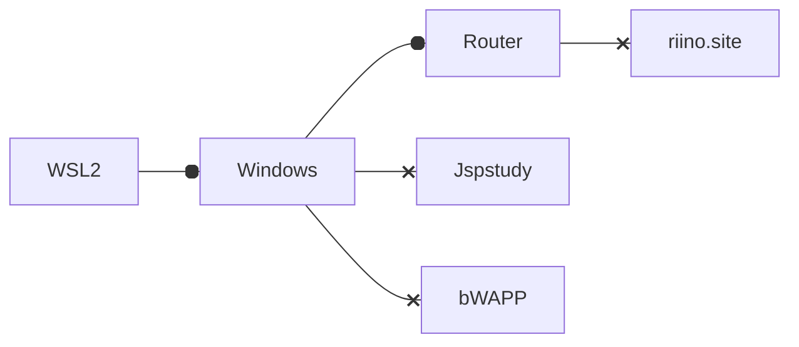
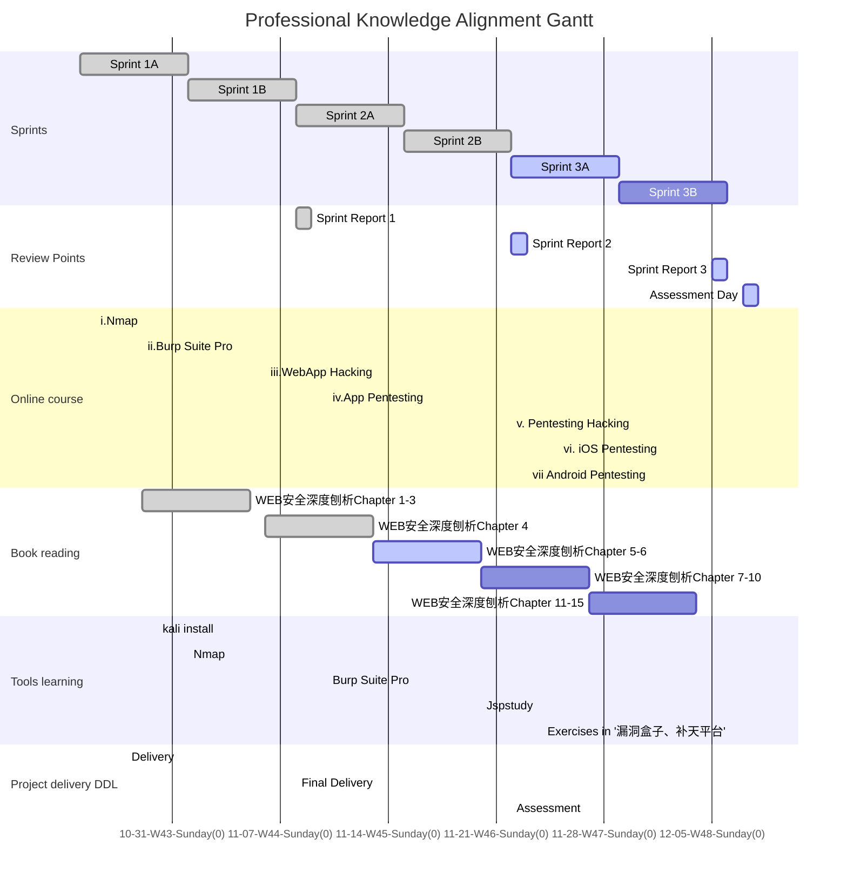
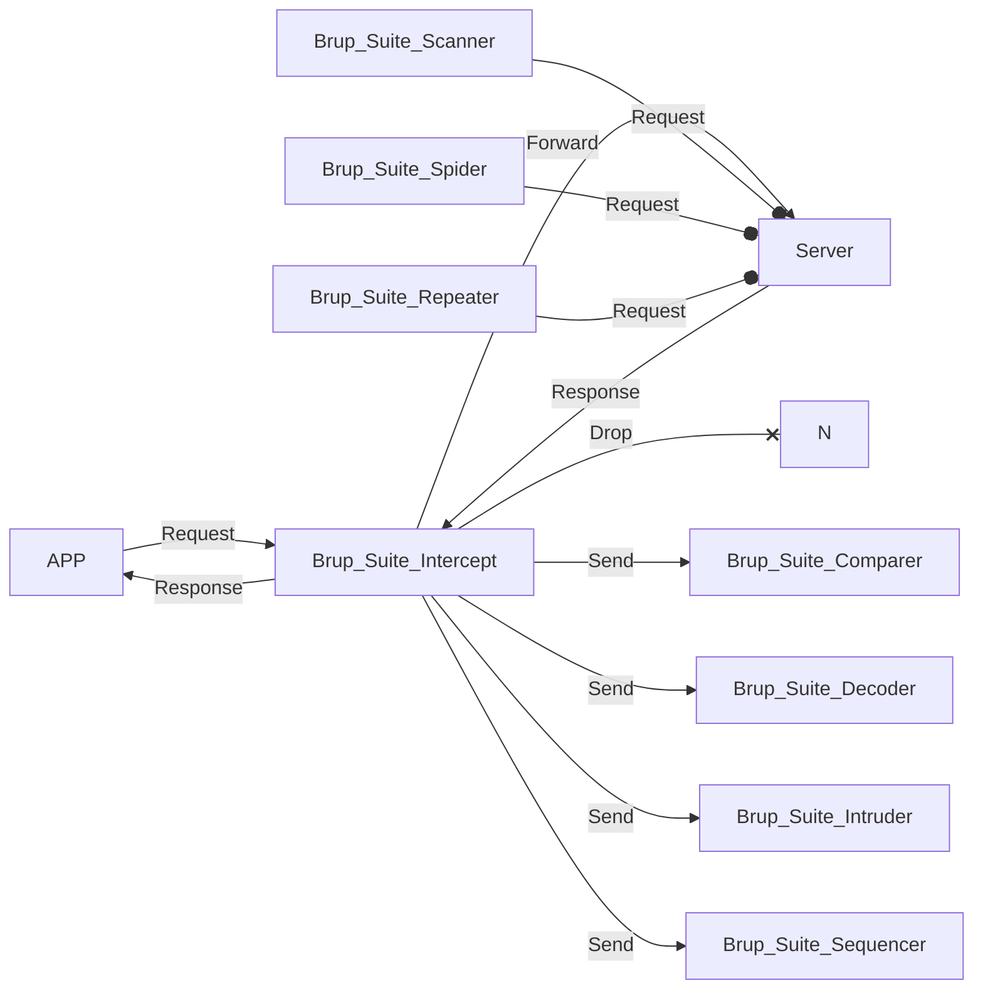

### Foreword

Under the tutelage of Jacob and Justus, this live learning dashboard is our version 2 dashboard of learning plan for the professional knowledge alignment, which is the basic knowledge of pentesting, hacking and the usage of corresponding tools. This page is designed for tracking my learning status and none of busniess information will be disclosed in this website. Besides, their will not be any information of projects in company, or any details of the content of the learning.

The knowledge roadmap(scope) will be based on the book 《WEB安全深度刨析》

Please read this page in **Light mode**, we will add mermaid dark style in next update of jekyll-theme-panda.   <a  onclick="modeSwitcher()" style=" color: #007bff" href="javascript:void(0)">Click here to switch theme. </a>

# Learning Schedule

#### Sprints

Inspired by Scrum, I make 2 weeks as a sprint to arrange what will be done. 

Before each sprint, I will decide what will be learnt and check the progress. In the end of each sprint, there will be a sprint report attached at the end of this page. Each sub-sprint will have 3 states like other works : done, active and todo.

#### Online course

Online course contains 7 online courses with different learning time. A course will be finished when met these two goals: a)Course is finished in learning website; b)Tried related tools in real world.

#### Book reading

To read the book and try the testing tools if needed.

#### Tools learning

Install and run tools in Windows or Kali, and try them in a website(riino.site) and a network(home wifi).  I prepared 2 environments: a) Windows 10 Home 21H1; b) Linux Kali - WSL2 running Win-Kex. In this situation, the network hierarchy will be like this:

#### Project delivery DDL

If meet urgent delivery requirement, there will be a 'delivery' event showing that the bandwidth will decrease in this period.

#### Gantt Chart

Gantt chart will show what I've done and what I'm doing. 

## WBS Status Sheet

Before a sprint some task will be moved out of backlog.

| WBS Name                  | Type           | Status    | Planned Sprint | Actual Sprint |
| ------------------------- | -------------- | --------- | -------------- | ------------- |
| i.Nmap                    | Online Course  | ✅Done     | 1A,1B          |               |
| ii.Burp Suite Pro         | Online Course  | ✅Done     | 1B             | 2A            |
| iii.Web App Hacking       | Online Course  | ✅Done     | 1B             | 2A            |
| iv.App pentesting         | Online Course  | ✅Done     | 2B             | 2B            |
| v.Pentesting/Hacking      | Online Course  | ☑️Learning | 2B             | 3A            |
| vi.iOS pentesting         | Online Course  | ☑️Learning | 3A             | 3A            |
| vii.Android pentesting    | Online Course  | ☑️Learning | 3A             | 3A            |
| WEB安全深度刨析Chapter 1  | Book Reading   | ✅Done     | 1A             | 1A            |
| WEB安全深度刨析Chapter 2  | Book Reading   | ✅Done     | 1A             | 1A            |
| WEB安全深度刨析Chapter 3  | Book Reading   | ✅Done     | 1A             | 1B            |
| WEB安全深度刨析Chapter 4  | Book Reading   | ✅Done     | 1B             | 1B            |
| WEB安全深度刨析Chapter 5  | Book Reading   | ✅Done     | 1B             | 2A            |
| WEB安全深度刨析Chapter 6  | Book Reading   | ✅Done     | 2A             | 2A            |
| WEB安全深度刨析Chapter 7  | Book Reading   | ✅Done     | 2A             | 2A            |
| WEB安全深度刨析Chapter 8  | Book Reading   | ☑️Learning | 3A             |               |
| WEB安全深度刨析Chapter 9  | Book Reading   | ☑️Learning | 3A             |               |
| WEB安全深度刨析Chapter 10 | Book Reading   | ☑️Learning | 3A             |               |
| WEB安全深度刨析Chapter 11 | Book Reading   | ☑️Learning | 3A             |               |
| WEB安全深度刨析Chapter 12 | Book Reading   | ☑️Learning | 3A             |               |
| WEB安全深度刨析Chapter 13 | Book Reading   | ☑️Learning | 3A             |               |
| WEB安全深度刨析Chapter 14 | Book Reading   | ☑️Learning | 3A             |               |
| WEB安全深度刨析Chapter 15 | Book Reading   | ☑️Learning | 3A             |               |
| WEB安全深度刨析Chapter 16 | Book Reading   | ☑️Learning | 1B             |               |
| Nmap                      | Tools learning | ✅Done     | 1B             | 2A            |
| Burp Suite Pro            | Tools learning | ✅Done     | 2A             | 2B            |

## Sprint 1 Report 

### Summary 

During Sprint 1, I explored basic knowledge of web security and how to use `nmap`, a web scanning tool. Besides, I got to know how to use Brup Suite toolkits. As for the basic knowledge section, I reviewed various web protocols And I did a brief review of 'Computer network' roadmap, including each layers in modern networks. Among these topics, I mainly checked HTTP and HTTPS protocol, which are the most common ones in web security field, and some cases about how to attack via network using these two protocols. 

Like every learner, I learnt `nmap`, a powerful and classic IP/port scanner. Based on the videos and the book, I learnt the basic usage of `nmap`, and the most common cases using `nmap` like scanning devices in a public Wi-Fi or check what service port is open in a target server. Additionally, understood that two main steps of  `nmap` searching : IP scanning and Service scanning(Ports). Over these knowledge, I explored the different usage of `nmap` using different addon commands in terminal, through which we can make settings to decide if using TCP or UDP, or confirm the scope of ports, or sending probes that won't make server notice. I personally divide the knowledge of `nmap` into two sections: how it works and how to use it. Over this framework, there are still lots of scripts we can embed into `nmap` to accomplish more complex task, like scan all static files in a server path. (Yet we can use other special tools to do this more quickly)

Besides, I learnt the Brup Suite interrupter function, which we can make Brup Suite listening a specific port, and using local proxy (yes, LAN proxy is also available) to transfer packages from apps (like the browser) into Brup Suite. Brup Suite will catch them and print out the content, where you can edit, examine(which is to use action button to send a package to other function of Brup Suite like the comparer), and this package will not be sent until you manually forward it. Basically, such procedure construct a 3-rd party attack in your machine. The differences between Brup Suite and Wiresharks(another network listener ) is that the former will actually 'catch' the package, and if you send the package via Brup, it will also 'catch' the response to show you, rather than send to the origin app directly. Therefore, CA issue will appear when using HTTPS since the origin app will discover that the response is not sent by the server but a address from Brup via the CA info. Therefore , we have to download the Brup's CA and manually let the origin app know that this CA can be trusted for no reason. 

### Outline

##### Computer network

HTTP

HTTPS

UDP/TCP

Proxy

ports and IP

##### nmap

Scan IP in selected scope

Scan IP randomly

Scan DNS address

Scan IP only

Scan UDP Service only

Check specific ports' status

Load scripts

Zenmap GUI

Nmap Cheat Sheet

##### Burp Suite 

Burp Suite Proxy

Burp Suite CA

Custom Proxy

Burp Suite Target

## Sprint 2 Report 

### Summary 

During sprint 2, I explored more about Brup Suite Pro, including its package interrupter, automation tools , and assistant tools.

Besides, I went more deeply into the practice of `nmap`, and made a simpler version of its cheat sheet inspired by https://www.stationx.net/nmap-cheat-sheet/

## Sprint 3 Report 

Available when sprint 3 ends.

