### Foreword

Under the tutelage of Jacob and Justus, this live learning dashboard is our version 2 dashboard of learning plan for the professional knowledge alignment, which is the basic knowledge of pentesting, hacking and the usage of corresponding tools. This page is designed for tracking my learning status and none of busniess information will be disclosed in this website. Besides, their will not be any information of projects in company, or any details of the content of the learning.

The knowledge roadmap(scope) will be based on the book 《WEB安全深度刨析》

Please reading this page in **Light mode**, we will add mermaid dark style in next update of jekyll-theme-panda.   <a  onclick="modeSwitcher()" style=" color: #007bff" href="javascript:void(0)">Click here to switch theme. </a>

# Learning Schedule

#### Sprints

Inspired by Scrum, I make 2 weeks as a sprint to arrange what will be done. 

Before each sprint, I will decide what will be learnt and check the progress. In the end of each sprint, there will be a sprint report attached at the end of this page. Each sub-sprint will have 3 states like other works : done, active and todo.

#### Online course

Online course contains 7 online courses with different learning time. A course will be finished when met these two goals: a)Course is finished in learning website; b)Tried related tools in real world.

#### Book reading

To read the book and try the testing tools if needed.

#### Tools learning

Install and run tools in Windows or Kali, and try them in a website(riino.site) and a network(home wifi).  I prepared 2 environments: a) Windows 10 Home 21H1; b) Linux Kali - WSL2 running Win-Kex. In this situation, the network hierarchy will be like this:

#### Project delivery DDL

If meet urgent delivery requirement, there will be a 'delivery' event showing that the bandwidth will decrease in this period.

#### Gantt Chart

Gantt chart will show what I've done and what I'm doing. 

```mermaid

gantt

title Professional Knowledge Alignment Gantt
todayMarker stroke-width:2px,stroke:#00,opacity:0.8
axisFormat  %m-%d-W%W-%A(%w)
section Sprints
Sprint 1A          :done,    des1, 2021-10-25,1w
Sprint 1B          :active,    des1, 2021-11-1,1w
Sprint 2A          :    des1, 2021-11-8,1w
Sprint 2B          :    des1, 2021-11-15,1w
Sprint 3A          :    des1, 2021-11-22,1w
Sprint 3B          :    des1, 2021-11-29,1w
section online course
i.Nmap         : active,   oc1, 2021-10-26,2021-11-02
ii.Burp Suite Pro: active,   oc2, 2021-11-29,2021-11-02
iii.WebApp Hacking: oc3, 2021-11-29,
iv.App Pentesting:oc4, 2021-11-29,
v. Pentesting Hacking:oc5, 2021-11-29,
vi. iOS Pentesting: oc6, 2021-11-29,
vii Android Pentesting:oc7, 2021-11-29,

section book reading
WEB安全深度刨析Chapter 1-3 :active , des1,2021-10-29,1w
WEB安全深度刨析Chapter 4 : ,2021-11-6,1w
WEB安全深度刨析Chapter 5-6 : ,2021-11-13,1w
WEB安全深度刨析Chapter 7-10 : 2021-11-20,1w
WEB安全深度刨析Chapter 11-15 : ,2021-11-27,2w
section tools learning
kali install: done,2021-10-30,2021-11-02
Nmap: active,2021-11-1,2021-11-06
Burp Suite Pro: 2021-11-06,2021-11-11

section project delivery DDL
Delivery 1:done, 2021-10-28,2021-11-02

```

## WBS Status Sheet

Before a sprint some task will be moved out of backlog.

| WBS Name                  | Type           | Status    | Planned Sprint | Actual Sprint |
| ------------------------- | -------------- | --------- | -------------- | ------------- |
| i.Nmap                    | Online Course  | ☑️Learning | 1A,1B          |               |
| ii.Burp Suite Pro         | Online Course  | ☑️earning  | 1B             |               |
| iii.Web App Hacking       | Online Course  | 🔲To-do    | 1B             |               |
| iv.App pentesting         | Online Course  | 🔲To-do    | In Backlog     |               |
| v.Pentesting/Hacking      | Online Course  | 🔲To-do    | In Backlog     |               |
| vi.iOS pentesting         | Online Course  | 🔲To-do    | In Backlog     |               |
| vii.Android pentesting    | Online Course  | 🔲To-do    | In Backlog     |               |
| WEB安全深度刨析Chapter 1  | Book Reading   | ✅Done     | 1A             | 1A            |
| WEB安全深度刨析Chapter 2  | Book Reading   | ✅Done     | 1A             | 1A            |
| WEB安全深度刨析Chapter 3  | Book Reading   | ✅Done     | 1A             | 1B            |
| WEB安全深度刨析Chapter 4  | Book Reading   | ☑️Learning | 1B             |               |
| WEB安全深度刨析Chapter 5  | Book Reading   | ☑️Learning | 1B             |               |
| WEB安全深度刨析Chapter 6  | Book Reading   | 🔲To-do    | In Backlog     |               |
| WEB安全深度刨析Chapter 7  | Book Reading   | 🔲To-do    | In Backlog     |               |
| WEB安全深度刨析Chapter 8  | Book Reading   | 🔲To-do    | In Backlog     |               |
| WEB安全深度刨析Chapter 9  | Book Reading   | 🔲To-do    | In Backlog     |               |
| WEB安全深度刨析Chapter 10 | Book Reading   | 🔲To-do    | In Backlog     |               |
| WEB安全深度刨析Chapter 11 | Book Reading   | 🔲To-do    | In Backlog     |               |
| WEB安全深度刨析Chapter 12 | Book Reading   | 🔲To-do    | In Backlog     |               |
| WEB安全深度刨析Chapter 13 | Book Reading   | 🔲To-do    | In Backlog     |               |
| WEB安全深度刨析Chapter 14 | Book Reading   | 🔲To-do    | In Backlog     |               |
| WEB安全深度刨析Chapter 15 | Book Reading   | 🔲To-do    | In Backlog     |               |
| WEB安全深度刨析Chapter 16 | Book Reading   | 🔲To-do    | 1B             |               |
| Nmap                      | Tools learning | ☑️Learning | 1B             |               |
| Burp Suite Pro            | Tools learning | 🔲To-do    | In Backlog     |               |

## Sprint 1 Report 

Available when sprint 1 ends.

## Sprint 2 Report 

Available when sprint 2 ends.

## Sprint 3 Report 

Available when sprint 3 ends.

